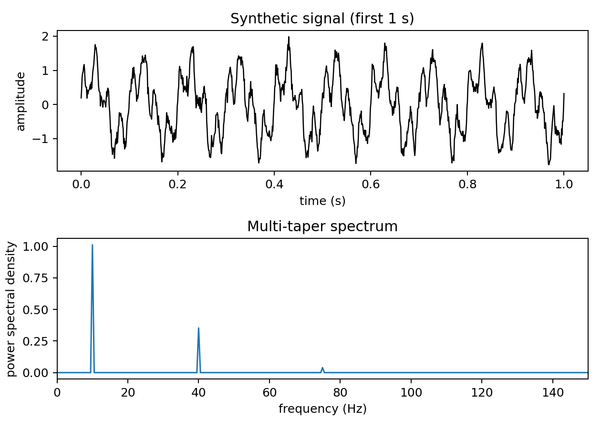
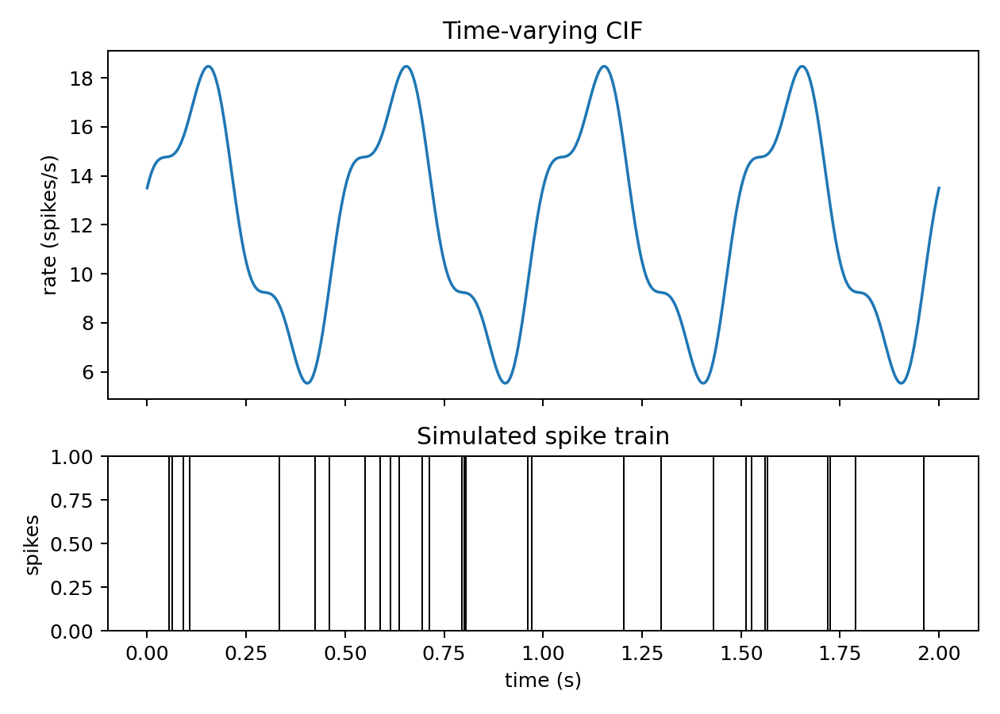
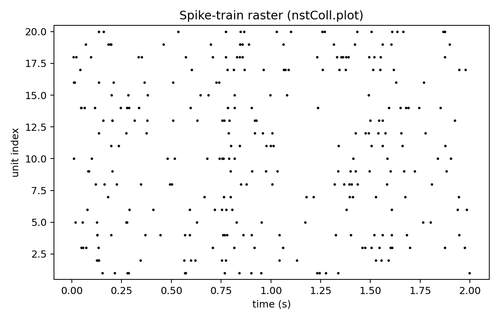

# nSTAT-python

`nSTAT-python` is a Python toolbox for neural spike-train analysis, modeling, and decoding.

[](https://github.com/cajigaslab/nSTAT-python/actions/workflows/ci.yml)
[](https://github.com/cajigaslab/nSTAT-python/actions/workflows/pages.yml)

## Installation

```bash
python -m pip install nstat
```

From source:

```bash
git clone git@github.com:cajigaslab/nSTAT-python.git
cd nSTAT-python
python -m pip install -e .[dev,docs,notebooks]
```

## How to install nSTAT (post-install setup)

Run the setup helper:

```bash
nstat-install
```

Equivalent Python API:

```python
from nstat.install import nstat_install

report = nstat_install()
```

## Examples

> These examples generate figures with `matplotlib` and save PNGs under `examples/readme_examples/images/`.
> The images below show the expected output.

Examples below require `matplotlib`:

```bash
python -m pip install matplotlib
```

### Example 1 — Multi-taper spectrum of a signal
Run:

```bash
python examples/readme_examples/example1_multitaper_spectrum.py
```

```python
import matplotlib
matplotlib.use("Agg")

from pathlib import Path

import matplotlib.pyplot as plt
import numpy as np

from nstat.compat.matlab import SignalObj

rng = np.random.default_rng(0)
fs_hz = 1000.0
dt = 1.0 / fs_hz
duration_s = 2.0
time = np.arange(0.0, duration_s, dt, dtype=float)

signal = (
    1.0 * np.sin(2.0 * np.pi * 10.0 * time)
    + 0.6 * np.sin(2.0 * np.pi * 40.0 * time + 0.3)
    + 0.2 * np.sin(2.0 * np.pi * 75.0 * time)
    + 0.12 * rng.standard_normal(time.size)
)

sig_obj = SignalObj(time=time, data=signal, name="synthetic_signal", units="a.u.")
freq_hz, psd = sig_obj.MTMspectrum()

fig, (ax1, ax2) = plt.subplots(2, 1, figsize=(7.0, 5.0), sharex=False)
preview_mask = time <= 1.0
ax1.plot(time[preview_mask], signal[preview_mask], color="black", linewidth=1.0)
ax1.set_xlabel("time (s)")
ax1.set_ylabel("amplitude")
ax1.set_title("Synthetic signal (first 1 s)")
ax2.plot(freq_hz, psd, color="tab:blue", linewidth=1.2)
ax2.set_xlim(0.0, 150.0)
ax2.set_xlabel("frequency (Hz)")
ax2.set_ylabel("power spectral density")
ax2.set_title("Multi-taper spectrum")
fig.tight_layout()

out_dir = Path("examples/readme_examples/images")
out_dir.mkdir(parents=True, exist_ok=True)
fig.savefig(out_dir / "readme_example1_multitaper_spectrum.png", dpi=180)
```

**Expected output**


### Example 2 — Simulate a spike train from a time-varying CIF
Run:

```bash
python examples/readme_examples/example2_simulate_cif_spiketrain.py
```

```python
import matplotlib
matplotlib.use("Agg")

from pathlib import Path

import matplotlib.pyplot as plt
import numpy as np

from nstat.compat.matlab import CIF, Covariate

np.random.seed(0)
dt = 0.001
duration_s = 2.0
time = np.arange(0.0, duration_s + 0.5 * dt, dt, dtype=float)

lambda_t = 12.0 + 5.5 * np.sin(2.0 * np.pi * 2.0 * time) + 1.5 * np.cos(2.0 * np.pi * 6.0 * time)
lambda_t = np.clip(lambda_t, 0.1, None)

lambda_cov = Covariate(time=time, data=lambda_t, name="Lambda(t)", units="spikes/s", labels=["lambda"])
coll = CIF.simulateCIFByThinningFromLambda(lambda_cov, 1, dt)
spike_times = coll.getNST(0).spike_times

fig, (ax1, ax2) = plt.subplots(2, 1, figsize=(7.0, 5.0), sharex=True, gridspec_kw={"height_ratios": [2.0, 1.0]})
ax1.plot(time, lambda_t, color="tab:blue", linewidth=1.4)
ax1.set_ylabel("rate (spikes/s)")
ax1.set_title("Time-varying CIF")
ax2.vlines(spike_times, 0.0, 1.0, color="black", linewidth=0.8)
ax2.set_ylim(0.0, 1.0)
ax2.set_xlabel("time (s)")
ax2.set_ylabel("spikes")
ax2.set_title("Simulated spike train")
fig.tight_layout()

out_dir = Path("examples/readme_examples/images")
out_dir.mkdir(parents=True, exist_ok=True)
fig.savefig(out_dir / "readme_example2_simulate_cif_spiketrain.png", dpi=180)
```

**Expected output**


### Example 3 — Spike-train raster (collection, nstColl.plot)
Run:

```bash
python examples/readme_examples/example3_spike_train_raster_nstcoll.py
```

```python
import matplotlib
matplotlib.use("Agg")

from pathlib import Path

import matplotlib.pyplot as plt
import numpy as np

from nstat.compat.matlab import CIF, Covariate

np.random.seed(0)
dt = 0.001
duration_s = 2.0
n_units = 20
time = np.arange(0.0, duration_s + 0.5 * dt, dt, dtype=float)

lambda_t = 9.0 + 4.0 * np.sin(2.0 * np.pi * 1.5 * time) + 2.0 * np.sin(2.0 * np.pi * 4.0 * time + 0.25)
lambda_t = np.clip(lambda_t, 0.1, None)

lambda_cov = Covariate(time=time, data=lambda_t, name="Lambda(t)", units="spikes/s", labels=["lambda"])
coll = CIF.simulateCIFByThinningFromLambda(lambda_cov, n_units, dt)

fig, ax = plt.subplots(figsize=(7.0, 4.5))
plt.sca(ax)
coll.plot()
ax.set_xlabel("time (s)")
ax.set_ylabel("unit index")
ax.set_title("Spike-train raster (nstColl.plot)")
ax.set_ylim(0.5, n_units + 0.5)
fig.tight_layout()

out_dir = Path("examples/readme_examples/images")
out_dir.mkdir(parents=True, exist_ok=True)
fig.savefig(out_dir / "readme_example3_spike_train_raster_nstcoll.png", dpi=180)
```

**Expected output**


## Examples and notebooks

- Python scripts and notebooks: `notebooks/`
- Learning notebooks are executable and suitable for local exploration or CI smoke runs.

## Documentation

- Docs home: [cajigaslab.github.io/nSTAT-python](https://cajigaslab.github.io/nSTAT-python/)
- Help index: [cajigaslab.github.io/nSTAT-python/help](https://cajigaslab.github.io/nSTAT-python/help/)

## Developer notes

- Run tests:

```bash
pytest -q
```

- Build docs:

```bash
sphinx-build -b html docs docs/_build
```

## Cite

Cajigas, I., Malika, W. Q., & Brown, E. N. (2012).  
nSTAT: Open-source neural spike train analysis toolbox for Matlab.  
Journal of Neuroscience Methods, 211, 245–264.  
https://doi.org/10.1016/j.jneumeth.2012.08.009
