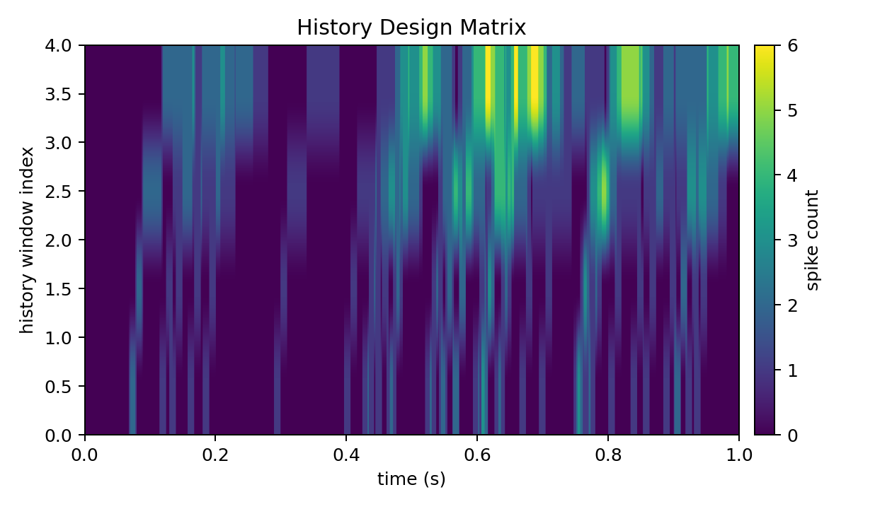
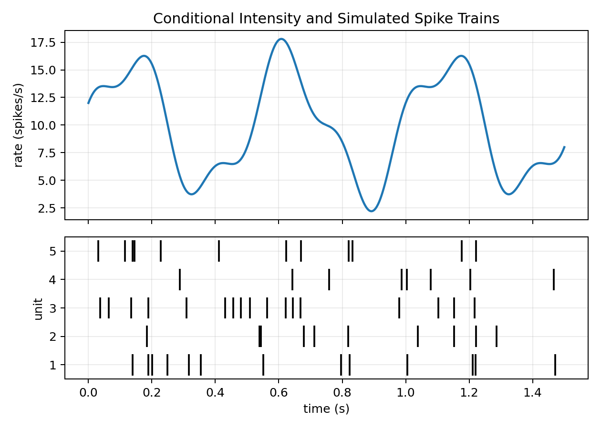
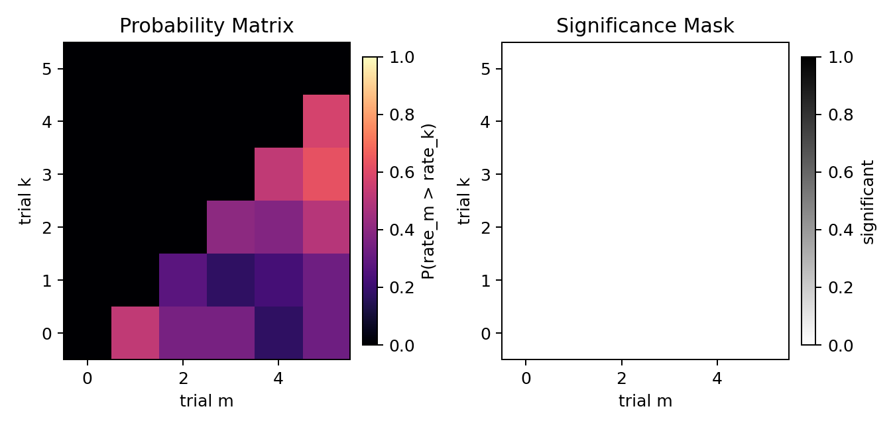

# nSTAT-python

`nSTAT-python` is a Python toolbox for neural spike-train analysis, modeling, and decoding.

[](https://github.com/cajigaslab/nSTAT-python/actions/workflows/ci.yml)
[](https://github.com/cajigaslab/nSTAT-python/actions/workflows/pages.yml)

## Installation

```bash
python -m pip install nstat
```

From source:

```bash
git clone git@github.com:cajigaslab/nSTAT-python.git
cd nSTAT-python
python -m pip install -e .[dev,docs,notebooks]
```

## How to install nSTAT (post-install setup)

Run the setup helper:

```bash
nstat-install
```

Equivalent Python API:

```python
from nstat.install import nstat_install

report = nstat_install()
```

## Quick examples

Examples below require `matplotlib`:

```bash
python -m pip install matplotlib
```

### Example 1: History design matrix heatmap
```python
import matplotlib
matplotlib.use("Agg")

import matplotlib.pyplot as plt
import numpy as np
from nstat.compat.matlab import History

np.random.seed(0)
spike_times = np.sort(np.random.uniform(0.05, 0.95, size=40))
t_grid = np.linspace(0.0, 1.0, 1001)

hist = History(np.array([0.0, 0.01, 0.02, 0.05, 0.10]))
H = hist.computeHistory(spike_times, t_grid)

fig, ax = plt.subplots(figsize=(7, 4))
im = ax.imshow(
    H.T,
    aspect="auto",
    origin="lower",
    extent=[t_grid[0], t_grid[-1], 0, H.shape[1]],
    cmap="viridis",
)
ax.set_xlabel("time (s)")
ax.set_ylabel("history window index")
fig.colorbar(im, ax=ax, pad=0.02)
fig.tight_layout()
```

**Expected output**


### Example 2: CIF simulation and spike rasters

```python
import matplotlib
matplotlib.use("Agg")

import matplotlib.pyplot as plt
import numpy as np
from nstat.compat.matlab import CIF, Covariate

np.random.seed(0)
t = np.linspace(0.0, 1.5, 1501)
lam = 10.0 + 6.0 * np.sin(2.0 * np.pi * 2.0 * t) + 2.0 * np.cos(2.0 * np.pi * 5.0 * t)
lam = np.clip(lam, 0.2, None)

lambda_sig = Covariate(time=t, data=lam, name="Lambda(t)", labels=["lambda"])
spike_coll = CIF.simulateCIFByThinningFromLambda(lambda_sig, numRealizations=8)

fig, (ax1, ax2) = plt.subplots(2, 1, figsize=(7, 5), sharex=True, gridspec_kw={"height_ratios": [2, 1.5]})
ax1.plot(t, lam, color="tab:blue", linewidth=1.8)
ax1.set_ylabel("rate (spikes/s)")

n_show = min(5, spike_coll.getNumUnits())
raster_data = [spike_coll.trains[i].spike_times for i in range(n_show)]
ax2.eventplot(raster_data, lineoffsets=np.arange(1, n_show + 1), linelengths=0.75, colors="k")
ax2.set_xlabel("time (s)")
ax2.set_ylabel("unit")
fig.tight_layout()
```

**Expected output**


### Example 3: Spike-rate confidence intervals summary

```python
import matplotlib
matplotlib.use("Agg")

import matplotlib.pyplot as plt
import numpy as np
from nstat.compat.matlab import DecodingAlgorithms

np.random.seed(0)
num_basis, num_trials, n_bins = 5, 6, 160
delta = 0.01

basis_idx = np.arange(1, num_basis + 1, dtype=float)[:, None]
trial_idx = np.arange(1, num_trials + 1, dtype=float)[None, :]
xk = 0.06 * np.sin(0.37 * basis_idx * trial_idx) + 0.04 * np.cos(0.19 * basis_idx * trial_idx)

wku = np.zeros((num_basis, num_basis, num_trials, num_trials), dtype=float)
for r in range(num_basis):
    wku[r, r, :, :] = 0.05 * np.eye(num_trials, dtype=float)

grid = np.arange(num_trials * n_bins, dtype=float).reshape(num_trials, n_bins)
d_n = ((np.sin(0.173 * grid) + np.cos(0.037 * grid)) > 1.15).astype(float)

_, prob, sig = DecodingAlgorithms.computeSpikeRateCIs(
    xk, wku, d_n, 0.0, (n_bins - 1) * delta, "binomial", delta, 0.0, [], 40, 0.05
)

fig, (ax1, ax2) = plt.subplots(1, 2, figsize=(7.5, 3.6))
im1 = ax1.imshow(prob, aspect="auto", origin="lower", cmap="magma", vmin=0.0, vmax=1.0)
im2 = ax2.imshow(sig, aspect="auto", origin="lower", cmap="gray_r", vmin=0.0, vmax=1.0)
fig.colorbar(im1, ax=ax1, fraction=0.046, pad=0.04)
fig.colorbar(im2, ax=ax2, fraction=0.046, pad=0.04)
fig.tight_layout()
```

**Expected output**


## Examples and notebooks

- Python scripts and notebooks: `notebooks/`
- Learning notebooks are executable and suitable for local exploration or CI smoke runs.

## Documentation

- Docs home: [cajigaslab.github.io/nSTAT-python](https://cajigaslab.github.io/nSTAT-python/)
- Help index: [cajigaslab.github.io/nSTAT-python/help](https://cajigaslab.github.io/nSTAT-python/help/)

## Developer notes

- Run tests:

```bash
pytest -q
```

- Build docs:

```bash
sphinx-build -b html docs docs/_build
```

## Cite

Cajigas, I., Malika, W. Q., & Brown, E. N. (2012).  
nSTAT: Open-source neural spike train analysis toolbox for Matlab.  
Journal of Neuroscience Methods, 211, 245–264.  
https://doi.org/10.1016/j.jneumeth.2012.08.009
