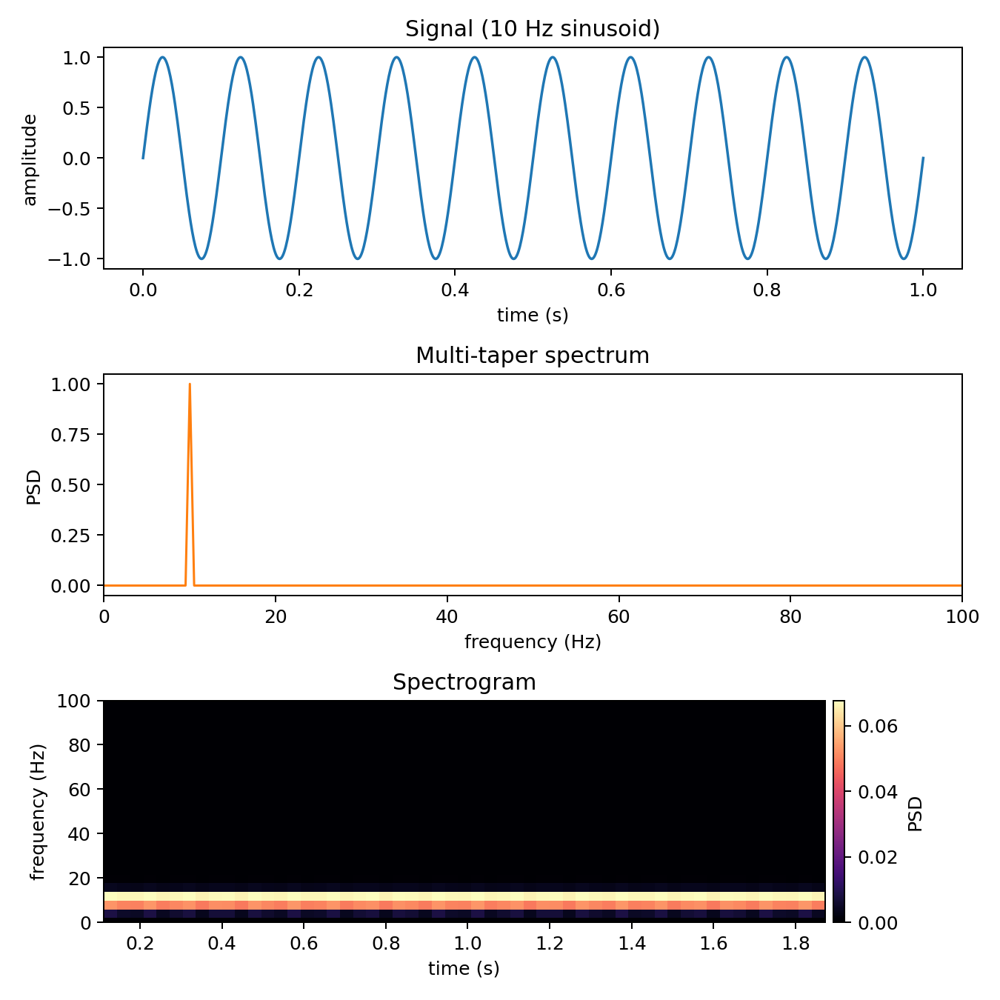
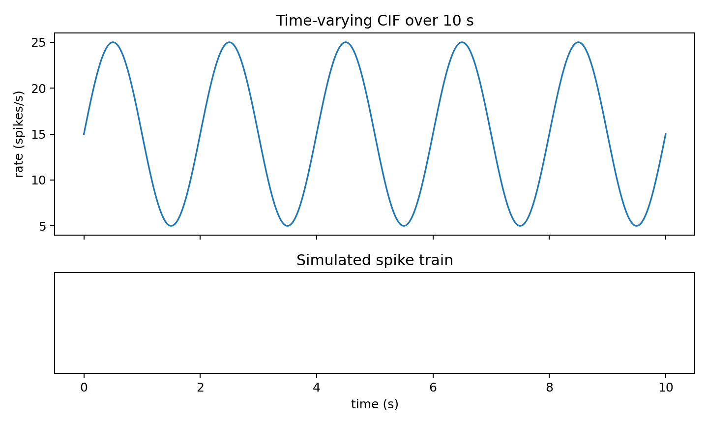
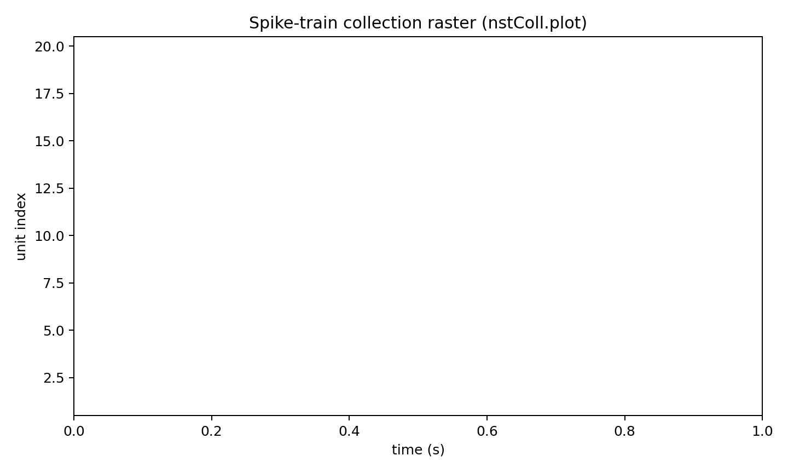
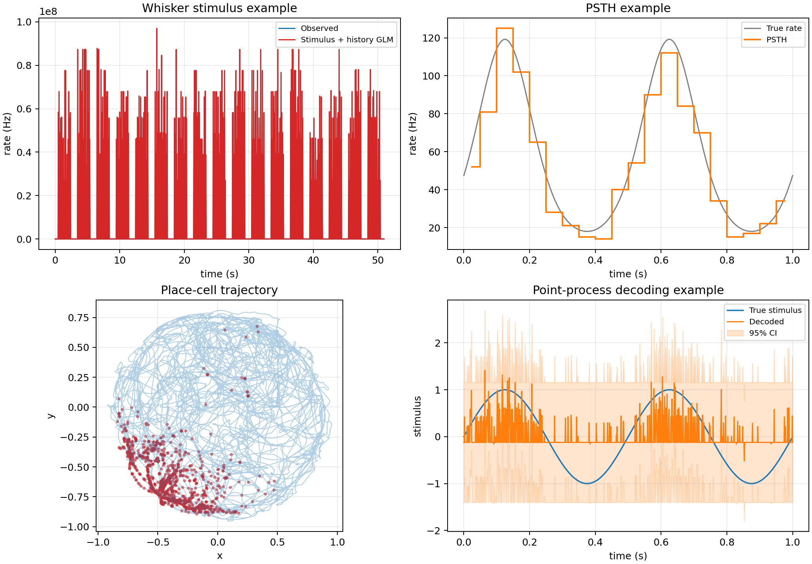

# nSTAT-python

`nSTAT-python` is a Python toolbox for neural spike-train analysis, modeling, and decoding.

[](https://github.com/cajigaslab/nSTAT-python/actions/workflows/ci.yml)
[](https://github.com/cajigaslab/nSTAT-python/actions/workflows/pages.yml)

## Installation

```bash
python -m pip install nstat
```

From source:

```bash
git clone git@github.com:cajigaslab/nSTAT-python.git
cd nSTAT-python
python -m pip install -e .[dev]
```

## Example data

`nSTAT-python` does not commit raw example data to the repository.

Install the example dataset with:

```bash
nstat-install --download-example-data always
```

Equivalent Python API:

```python
from nstat.data_manager import ensure_example_data

data_dir = ensure_example_data(download=True)
print(data_dir)
```

## How to install nSTAT (post-install setup)

Run the setup helper:

```bash
nstat-install
```

Equivalent Python API:

```python
from nstat.install import nstat_install

report = nstat_install()
```

## Examples

> These examples generate figures with `matplotlib` and save PNGs under `examples/readme_examples/images/`.
> The images below show the expected output.

Examples below require `matplotlib`:

```bash
python -m pip install matplotlib
```

### Example 1 — Single sinusoid: signal + multitaper spectrum + spectrogram
Run:

```bash
python examples/readme_examples/example1_multitaper_and_spectrogram.py
```

```python
import matplotlib
matplotlib.use("Agg")

from pathlib import Path

import matplotlib.pyplot as plt
import numpy as np
from scipy.signal import spectrogram

from nstat.compat.matlab import SignalObj

fs_hz = 1000.0
dt = 1.0 / fs_hz
duration_s = 2.0
f0_hz = 10.0
time = np.arange(0.0, duration_s, dt, dtype=float)

signal = np.sin(2.0 * np.pi * f0_hz * time)
sig_obj = SignalObj(time=time, data=signal, name="sine_signal", units="a.u.")
freq_hz, psd = sig_obj.MTMspectrum()
f_spec, t_spec, sxx = spectrogram(signal, fs=fs_hz, nperseg=256, noverlap=224, scaling="density", mode="psd")

fig, axes = plt.subplots(3, 1, figsize=(7.5, 7.5))
preview_mask = time <= 1.0
axes[0].plot(time[preview_mask], signal[preview_mask], color="tab:blue", linewidth=1.4)
axes[0].set_title("Signal (10 Hz sinusoid)")
axes[0].set_xlabel("time (s)")
axes[0].set_ylabel("amplitude")
axes[1].plot(freq_hz, psd, color="tab:orange", linewidth=1.2)
axes[1].set_xlim(0.0, 100.0)
axes[1].set_title("Multi-taper spectrum")
axes[1].set_xlabel("frequency (Hz)")
axes[1].set_ylabel("PSD")
im = axes[2].pcolormesh(t_spec, f_spec, sxx, shading="auto", cmap="magma")
axes[2].set_ylim(0.0, 100.0)
axes[2].set_title("Spectrogram")
axes[2].set_xlabel("time (s)")
axes[2].set_ylabel("frequency (Hz)")
fig.colorbar(im, ax=axes[2], pad=0.01, label="PSD")
fig.tight_layout()

out_dir = Path("examples/readme_examples/images")
out_dir.mkdir(parents=True, exist_ok=True)
fig.savefig(out_dir / "readme_example1_multitaper_and_spectrogram.png", dpi=180)
```

**Expected output**


### Example 2 — Time-varying CIF over 10 seconds (single-frequency sinusoid)
Run:

```bash
python examples/readme_examples/example2_simulate_cif_spiketrain_10s.py
```

```python
import matplotlib
matplotlib.use("Agg")

from pathlib import Path

import matplotlib.pyplot as plt
import numpy as np

from nstat.compat.matlab import CIF, Covariate

np.random.seed(0)
dt = 0.001
duration_s = 10.0
t = np.arange(0.0, duration_s + dt, dt, dtype=float)

f_hz = 0.5
baseline_hz = 15.0
amp_hz = 10.0
lam = np.clip(baseline_hz + amp_hz * np.sin(2.0 * np.pi * f_hz * t), 0.2, None)

lambda_cov = Covariate(time=t, data=lam, name="Lambda", units="spikes/s", labels=["lambda"])
spikes = CIF.simulateCIFByThinningFromLambda(lambda_cov, 1, dt)
spike_times = spikes.getNST(0).spike_times

fig, (ax1, ax2) = plt.subplots(2, 1, figsize=(8.0, 4.8), sharex=True, gridspec_kw={"height_ratios": [2.0, 1.0]})
ax1.plot(t, lam, color="tab:blue", linewidth=1.3)
ax1.set_ylabel("rate (spikes/s)")
ax1.set_title("Time-varying CIF over 10 s")
ax2.vlines(spike_times, 0.0, 1.0, color="black", linewidth=0.8)
ax2.set_ylim(0.0, 1.0)
ax2.set_yticks([])
ax2.set_xlabel("time (s)")
ax2.set_title("Simulated spike train")
fig.tight_layout()

out_dir = Path("examples/readme_examples/images")
out_dir.mkdir(parents=True, exist_ok=True)
fig.savefig(out_dir / "readme_example2_simulate_cif_spiketrain_10s.png", dpi=180)
```

**Expected output**


### Example 3 — Spike train collection raster from Example 2
Run:

```bash
python examples/readme_examples/example3_nstcoll_raster_from_example2.py
```

```python
import matplotlib
matplotlib.use("Agg")

from pathlib import Path

import matplotlib.pyplot as plt
import numpy as np

from nstat.compat.matlab import CIF, Covariate

np.random.seed(0)
dt = 0.001
duration_s = 10.0
n_units = 20
t = np.arange(0.0, duration_s + dt, dt, dtype=float)

f_hz = 0.5
baseline_hz = 15.0
amp_hz = 10.0
lam = np.clip(baseline_hz + amp_hz * np.sin(2.0 * np.pi * f_hz * t), 0.2, None)

lambda_cov = Covariate(time=t, data=lam, name="Lambda", units="spikes/s", labels=["lambda"])
coll = CIF.simulateCIFByThinningFromLambda(lambda_cov, n_units, dt)

fig, ax = plt.subplots(figsize=(8.0, 4.8))
plt.sca(ax)
coll.plot()
ax.set_xlabel("time (s)")
ax.set_ylabel("unit index")
ax.set_title("Spike-train collection raster (nstColl.plot)")
ax.set_ylim(0.5, n_units + 0.5)
fig.tight_layout()

out_dir = Path("examples/readme_examples/images")
out_dir.mkdir(parents=True, exist_ok=True)
fig.savefig(out_dir / "readme_example3_nstcoll_raster.png", dpi=180)
```

**Expected output**


### nSTATPaperExamples

Run:

```bash
python examples/readme_examples/example4_nstatpaperexamples_overview.py
```

```python
import matplotlib
matplotlib.use("Agg")

from pathlib import Path

from nstat.paper_examples import run_paper_examples

repo_root = Path(".").resolve()
results, payloads = run_paper_examples(repo_root, return_plot_data=True)
print(results["experiment2"])
print(results["experiment3"])
print(results["experiment4"])
print(results["experiment5"])
```

**Expected output**


Complete catalog of nSTATPaperExamples notebooks:

- [AnalysisExamples](notebooks/AnalysisExamples.ipynb) — Notebook example for AnalysisExamples.
- [ConfigCollExamples](notebooks/ConfigCollExamples.ipynb) — Notebook example for ConfigCollExamples.
- [CovCollExamples](notebooks/CovCollExamples.ipynb) — Notebook example for CovCollExamples.
- [CovariateExamples](notebooks/CovariateExamples.ipynb) — Notebook example for CovariateExamples.
- [DecodingExample](notebooks/DecodingExample.ipynb) — Notebook example for DecodingExample.
- [DecodingExampleWithHist](notebooks/DecodingExampleWithHist.ipynb) — Notebook example for DecodingExampleWithHist.
- [EventsExamples](notebooks/EventsExamples.ipynb) — Notebook example for EventsExamples.
- [ExplicitStimulusWhiskerData](notebooks/ExplicitStimulusWhiskerData.ipynb) — Notebook example for ExplicitStimulusWhiskerData.
- [FitResSummaryExamples](notebooks/FitResSummaryExamples.ipynb) — Notebook example for FitResSummaryExamples.
- [FitResultExamples](notebooks/FitResultExamples.ipynb) — Notebook example for FitResultExamples.
- [HippocampalPlaceCellExample](notebooks/HippocampalPlaceCellExample.ipynb) — Notebook example for HippocampalPlaceCellExample.
- [HistoryExamples](notebooks/HistoryExamples.ipynb) — Notebook example for HistoryExamples.
- [NetworkTutorial](notebooks/NetworkTutorial.ipynb) — Notebook example for NetworkTutorial.
- [PPSimExample](notebooks/PPSimExample.ipynb) — Notebook example for PPSimExample.
- [PPThinning](notebooks/PPThinning.ipynb) — Notebook example for PPThinning.
- [PSTHEstimation](notebooks/PSTHEstimation.ipynb) — Notebook example for PSTHEstimation.
- [SignalObjExamples](notebooks/SignalObjExamples.ipynb) — Notebook example for SignalObjExamples.
- [StimulusDecode2D](notebooks/StimulusDecode2D.ipynb) — Notebook example for StimulusDecode2D.
- [TrialConfigExamples](notebooks/TrialConfigExamples.ipynb) — Notebook example for TrialConfigExamples.
- [TrialExamples](notebooks/TrialExamples.ipynb) — Notebook example for TrialExamples.
- [ValidationDataSet](notebooks/ValidationDataSet.ipynb) — Notebook example for ValidationDataSet.
- [mEPSCAnalysis](notebooks/mEPSCAnalysis.ipynb) — Notebook example for mEPSCAnalysis.
- [nSTATPaperExamples](notebooks/nSTATPaperExamples.ipynb) — Notebook example for nSTATPaperExamples.
- [nSpikeTrainExamples](notebooks/nSpikeTrainExamples.ipynb) — Notebook example for nSpikeTrainExamples.
- [nstCollExamples](notebooks/nstCollExamples.ipynb) — Notebook example for nstCollExamples.
- [AnalysisExamples2](notebooks/AnalysisExamples2.ipynb) — Notebook example for AnalysisExamples2.
- [FitResultReference](notebooks/FitResultReference.ipynb) — Notebook example for FitResultReference.
- [HybridFilterExample](notebooks/HybridFilterExample.ipynb) — Notebook example for HybridFilterExample.

## Documentation

- Docs home: [cajigaslab.github.io/nSTAT-python](https://cajigaslab.github.io/nSTAT-python/)
- Help index: [cajigaslab.github.io/nSTAT-python/help](https://cajigaslab.github.io/nSTAT-python/help/)

## Developer notes

- Run tests:

```bash
pytest -q
```

- Build docs:

```bash
sphinx-build -b html docs docs/_build
```

## Cite

Cajigas, I., Malika, W. Q., & Brown, E. N. (2012).  
nSTAT: Open-source neural spike train analysis toolbox for Matlab.  
Journal of Neuroscience Methods, 211, 245–264.  
https://doi.org/10.1016/j.jneumeth.2012.08.009
