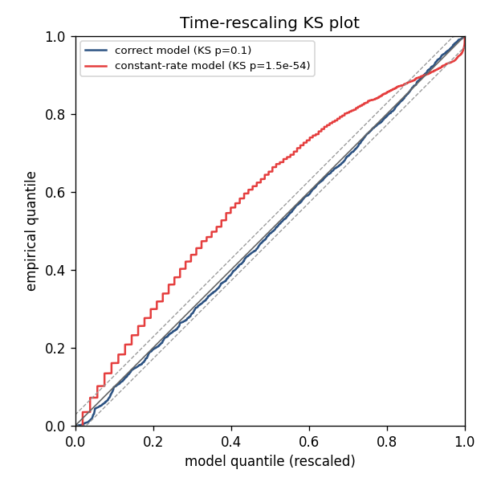

# Goodness-of-fit and decoding

> **Goal of this page.** Two questions every spike-train model must answer:
> *Does the model fit?* (goodness-of-fit via time-rescaling) and *Can we read
> out the stimulus/state from spikes?* (decoding).

## Is the model any good? The time-rescaling theorem

A low AIC means a model fits *better than another model* — not that it fits
*well*. For an absolute check, nSTAT uses the **time-rescaling theorem**
([Brown, Barbieri, Ventura, Kass & Frank 2002](https://pubmed.ncbi.nlm.nih.gov/11802915/)).

The idea is elegant. Take the fitted conditional intensity `λ(t | H_t)` and
integrate it between consecutive spikes to get the **rescaled intervals**

```
z_k = ∫_{t_{k-1}}^{t_k} λ(u | H_u) du.
```

The theorem says: **if the model is correct**, the `z_k` are independent and
exponentially distributed with rate 1 — equivalently, after the transform
`u_k = 1 − exp(−z_k)`, they are uniform on `[0, 1]`. So you can *test the
model* by checking whether the `u_k` look uniform, with a **Kolmogorov–Smirnov
(KS) test**. nSTAT does this for you:

```python
ks = fit.computeKSStats()
print(ks["ks_statistic"], ks["ks_pvalue"])
```



*The same data fit two ways. The **correct** model (blue) stays inside the 95%
confidence band — it fits. The **constant-rate** model (red), which matches the
mean rate but ignores the stimulus, departs far outside the band and is
rejected (p ≈ 1e-54). Generated by the
[teaching tutorial](https://github.com/cajigaslab/nSTAT-python/blob/main/examples/tutorials/encoding_to_goodness_of_fit.py).*

**Reading a KS plot.** Plot the empirical CDF of the `u_k` against the
diagonal, with 95% confidence bands. If the curve stays inside the bands, the
model captures the spiking statistics. Systematic departures diagnose *what*
is wrong:

- Bowing away from the diagonal → the rate is mis-scaled.
- Departures near 0 → the short-interval (refractory/history) structure is
  unmodeled — add or lengthen history terms.

> **Historical note.** A bug in the MATLAB original used `sampleRate` instead
> of `1/sampleRate` as the bin width, invalidating the KS test for any
> `sampleRate ≠ 1`. nSTAT-python fixes this — see the README "Code audit".

## Per-neuron is not enough: population goodness-of-fit

Each neuron can pass its *own* KS test while the model still misses how
neurons fire *together*. The classic failure: model a synchronously firing
pair as two independent neurons. Both per-neuron KS tests pass, yet the joint
model is plainly wrong.

The **multivariate (marked) time-rescaling** framework of
[Tao, Weber, Arai & Eden (2018)](https://pubmed.ncbi.nlm.nih.gov/30298220/)
catches exactly this. It rescales the *population* as one marked point process
and applies a joint KS plus a mark χ². nSTAT implements it as a pure-NumPy
core function:

```python
from nstat import population_time_rescale

# counts_list[k]: binned spike counts for neuron k
# lam_per_bin_list[k]: the model's expected counts per bin for neuron k
res = population_time_rescale(counts_list, lam_per_bin_list, n_tau_bins=5)
print(res.ground_ks_pvalue, res.mark_chi2_pvalue)
# On a synchronous pair modeled as independent, the per-neuron KS tests pass
# but the population ground-process KS rejects at p ≈ 3e-49.
```

Always check **both**: per-neuron `computeKSStats` *and*, for population
models, `population_time_rescale`.

## Decoding: reading the stimulus/state from spikes

Goodness-of-fit asks "does the *encoding* model fit?" **Decoding** asks the
inverse: given the spikes, what was the stimulus or latent state? This is how
brain–machine interfaces turn motor-cortex spikes into cursor movement.

nSTAT's workhorse is the **point-process adaptive filter (PPAF)**
([Eden, Frank, Barbieri, Solo & Brown 2004](https://pubmed.ncbi.nlm.nih.gov/15070506/)).
It is the spiking analogue of the Kalman filter: a recursive Bayesian
estimator that, at each instant, predicts the state forward and then corrects
the prediction using the spikes just observed, weighting by each neuron's
fitted CIF (its tuning). Because spikes are all-or-none point events rather
than Gaussian measurements, the update uses the point-process likelihood
instead of the Kalman gain — but the predict/correct rhythm is the same.


*The PPAF reconstructs a hidden stimulus (orange) from the spikes of a 20-cell
population (blue), with a 95% credible band. More cells with diverse tuning
shrink the band and the error — see the runnable
[decoding tutorial](https://github.com/cajigaslab/nSTAT-python/blob/main/examples/tutorials/decoding_ppaf.py).*

Variants in nSTAT:

- **PPAF** — continuous state (e.g. stimulus value, hand position) from a
  population's spikes.
- **Hybrid point-process filter (PPHF)** — jointly estimates a *discrete*
  mode and a *continuous* state (e.g. reach goal + trajectory), combining a
  hidden Markov model with the point-process filter.

These are exercised end-to-end in Paper Example 05.

## Decoding without spike sorting: clusterless

Recall that spike sorting is imperfect
([Harris et al. 2000](https://pubmed.ncbi.nlm.nih.gov/10899214/)) and discards
information by forcing each spike into one unit. **Clusterless decoding**
sidesteps sorting: it decodes directly from each spike's *waveform features*
(a "mark"), modeling the joint distribution of marks and the state. The modern
state-space realization is
[Denovellis et al. (2021)](https://pubmed.ncbi.nlm.nih.gov/34570699/), bridged
by the opt-in `nstat.extras.decoding.clusterless_bridge`
(`fit_clusterless_decoder`, `fit_clusterless_classifier`). It is the natural
descendant of nSTAT's PPAF/PPHF for unsorted data.

## Check your understanding

1. A model has the lowest AIC of all you tried, but its KS curve leaves the
   confidence band. Should you trust it?
2. Why is decoding done from a *population* rather than a single neuron?

<details>
<summary>Show answers</summary>

1. **No.** AIC only ranks models *relative to each other*; leaving the KS band
   means the model is **misspecified** in absolute terms. Prefer the lowest-AIC
   model that **also passes** goodness-of-fit.
2. A single neuron is **ambiguous** about the state. A population with diverse
   tuning **jointly constrains** it — decode error falls steadily as you add
   cells (see the decoding tutorial).

</details>

## See also

- Runnable tutorial (no data needed): the time-rescaling KS test in action,
  correct vs. misspecified model —
  [`examples/tutorials/encoding_to_goodness_of_fit.py`](https://github.com/cajigaslab/nSTAT-python/blob/main/examples/tutorials/encoding_to_goodness_of_fit.py)
- Runnable tutorial (no data needed): decode a hidden stimulus from a
  population with the PPAF —
  [`examples/tutorials/decoding_ppaf.py`](https://github.com/cajigaslab/nSTAT-python/blob/main/examples/tutorials/decoding_ppaf.py)
- Runnable example: PPAF / PPHF decoding — Paper Example 05
  [`examples/paper/example05_decoding_ppaf_pphf.py`](https://github.com/cajigaslab/nSTAT-python/blob/main/examples/paper/example05_decoding_ppaf_pphf.py)
- Notebooks:
  [`DecodingExample.ipynb`](https://github.com/cajigaslab/nSTAT-python/blob/main/notebooks/DecodingExample.ipynb),
  [`HybridFilterExample.ipynb`](https://github.com/cajigaslab/nSTAT-python/blob/main/notebooks/HybridFilterExample.ipynb)
- API: `FitResult.computeKSStats`, `population_time_rescale`,
  `DecodingAlgorithms`, `nstat.extras.decoding.clusterless_bridge` in the
  [API reference](../api.rst)
- [Glossary](glossary.md) · [Bibliography](bibliography.md)
