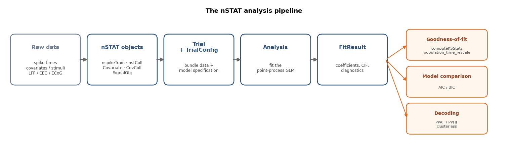

# Concepts &amp; Background

This section teaches the neuroscience and statistics behind nSTAT, not just
the API. It is written for students and newcomers: each page builds intuition
first, then shows the matching nSTAT objects and a runnable snippet, and cites
the primary literature so you can go deeper. No prior neuroscience is assumed.

**Jump in by goal:**
*I want to…* &nbsp;
[fit a GLM](spike_trains_and_glms.md) ·
[check a model's fit](goodness_of_fit_and_decoding.md) ·
[analyze LFP / spectra](lfp_and_spectral.md) ·
[decode a stimulus/state](goodness_of_fit_and_decoding.md) ·
[model learning across trials](state_space_and_em.md) ·
[measure coupling between neurons](network_connectivity.md) ·
[report uncertainty](uncertainty_and_confidence.md) ·
[avoid common mistakes](pitfalls_and_faq.md) ·
[look up a term](glossary.md).

> Every page in this track opens with a **Glossary jumps** box linking to the
> relevant entries in the [glossary](glossary.md) — direct deep-links to plain
> definitions of every term.

## Suggested learning path

1. **[Microelectrode recordings: spikes and the LFP](microelectrode_recordings.md)**
   — what an electrode actually measures, how the broadband signal splits into
   spikes and the LFP, single- vs multi-unit activity, and spike sorting.
   *The physical grounding for everything else.*
2. **[Spike trains and point-process GLMs](spike_trains_and_glms.md)** —
   spike trains as point processes, the conditional intensity function, and
   fitting it with point-process GLMs (stimulus + history + ensemble).
   *The core encoding model.*
3. **[The LFP and spectral analysis](lfp_and_spectral.md)** — the local field
   potential and the continuous-signal tools: multitaper spectra,
   spectrograms, and Kalman filtering (applies to LFP, EEG, ECoG).
4. **[Goodness-of-fit and decoding](goodness_of_fit_and_decoding.md)** —
   the time-rescaling KS test, population goodness-of-fit, and reading the
   stimulus/state back out with point-process and clusterless decoders.
5. **[State-space models: learning dynamics and EM](state_space_and_em.md)** —
   models whose parameters change over time: the across-trial state-space GLM
   (SSGLM) and EM-trained latent state-space models. *Where to go after the
   static GLM.*
6. **[Network connectivity and functional coupling](network_connectivity.md)** —
   how neurons influence each other (ensemble GLM terms, cross-correlograms,
   Granger), and why correlation is not connection.

Hands-on companions (both run on simulated data, no download):

- Notebook —
  [`examples/tutorials/Tutorial_MicroelectrodeToDecoding.ipynb`](https://github.com/cajigaslab/nSTAT-python/blob/main/examples/tutorials/Tutorial_MicroelectrodeToDecoding.ipynb):
  a guided tour spanning every topic above (spikes vs. LFP, spike trains,
  multitaper spectra, GLM fitting, goodness-of-fit, decoding), with figures.
- Script —
  [`examples/tutorials/encoding_to_goodness_of_fit.py`](https://github.com/cajigaslab/nSTAT-python/blob/main/examples/tutorials/encoding_to_goodness_of_fit.py):
  the encoding → GLM → goodness-of-fit arc as a four-act lesson, with a
  correct-vs-wrong model contrast.
- Capstone (real data) —
  [`examples/tutorials/place_cell_walkthrough.py`](https://github.com/cajigaslab/nSTAT-python/blob/main/examples/tutorials/place_cell_walkthrough.py):
  the full encode → check → decode arc on a real hippocampal place-cell
  recording (downloaded on first run), ending in the honest lesson that a model
  can decode well yet still fail goodness-of-fit.

Going further (once the core pages click):

- **[Rhythmic firing and the clinical microelectrode](rhythmic_firing_and_clinical_microelectrode.md)** —
  oscillatory (tremor) cells modeled as a point-process GLM with a periodic
  covariate, and the applied setting of a microelectrode advanced into a deep
  brain nucleus during DBS surgery — firing-rate localization, the beta-band
  field-potential biomarker, and reading the rhythm back out with the PPAF.
- **[Uncertainty and confidence intervals](uncertainty_and_confidence.md)** —
  how nSTAT quantifies the uncertainty in every estimate, and why an estimate
  without an interval is only half an answer.
- **[Population geometry](population_geometry.md)** — from single-neuron models
  to the low-dimensional *neural manifold* a population traces out.
- **[From filters to deep learning](from_filters_to_deep_learning.md)** — how
  nSTAT's classical decoders connect to modern deep-learning and foundation
  models for neural data.
- **[Further study](further_study.md)** — a short map of topics nSTAT does
  not implement, with primary references for each.
- **[Self-check](self_check.md)** — quizzes for every topic plus cross-cutting
  synthesis questions.

Reference material:

- **[Common pitfalls & FAQ](pitfalls_and_faq.md)** — the mistakes that quietly
  invalidate an analysis, and how to avoid them. Skim before your first real
  analysis.
- **[Glossary](glossary.md)** — plain-language definitions, each linked to the
  relevant nSTAT object.
- **[Annotated bibliography](bibliography.md)** — the primary sources, with a
  note on why each matters for nSTAT users.

## How the concepts map to nSTAT



*The pipeline at a glance: raw data become nSTAT objects, a `Trial` plus a
`TrialConfig` specify the model, `Analysis` fits it, and the resulting
`FitResult` feeds goodness-of-fit, model comparison, and decoding.*

| Concept | nSTAT objects | Example |
|---|---|---|
| Spike trains | `nspikeTrain`, `nstColl` | `nSpikeTrainExamples.ipynb` |
| Encoding GLM | `Analysis`, `TrialConfig`, `FitResult` | Paper Example 02 |
| Across-trial learning (SSGLM) | `nstColl.ssglm()` / `ssglmFB()` | Paper Example 03 |
| EM-trained state-space models | `nstat.extras.em.dynamax_bridge` | `examples/extras/em_dynamax_demo.py` |
| Goodness-of-fit | `FitResult.computeKSStats`, `population_time_rescale` | Paper Examples 01–03 |
| LFP / spectra | `SignalObj` (`MTMspectrum`, `spectrogram`) | `SignalObjExamples.ipynb` |
| Decoding | `DecodingAlgorithms` (PPAF/PPHF), `clusterless_bridge` | Paper Example 05 |
| Functional coupling | `TrialConfig` ensemble terms, `Analysis` (Granger) | `network_coupling.py` |
| Rhythmic / tremor cells | periodic `Covariate`, `Analysis`, `FitResult` | `clinical_microelectrode_walkthrough.py` |
| Beta biomarker (adaptive DBS) | `SignalObj` (`MTMspectrum`, `spectrogram`) | `clinical_microelectrode_walkthrough.py` |

Once the concepts are clear, see the
[Paper-aligned toolbox map](../PaperOverview.md) for the full API crosswalk and
the [paper-example gallery](../paper_examples.md) for worked analyses with
figures.

```{toctree}
:maxdepth: 1
:hidden:

microelectrode_recordings
spike_trains_and_glms
lfp_and_spectral
goodness_of_fit_and_decoding
state_space_and_em
network_connectivity
uncertainty_and_confidence
rhythmic_firing_and_clinical_microelectrode
population_geometry
from_filters_to_deep_learning
further_study
self_check
pitfalls_and_faq
glossary
bibliography
```
