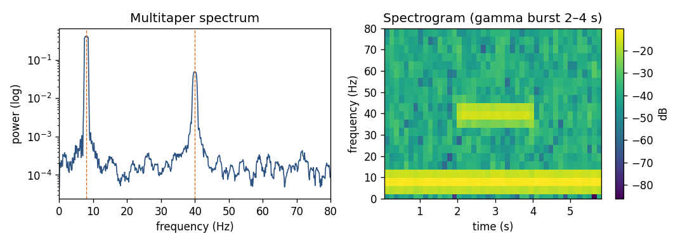

# The LFP and spectral analysis

> **Goal of this page.** Explain the local field potential (LFP) and the
> continuous-signal tools in nSTAT: multitaper spectra, spectrograms, and
> Kalman filtering. These apply equally to LFP, EEG, and ECoG.
>
> **Glossary jumps:** [LFP](glossary.md#local-field-potential) ·
> [EEG / ECoG](glossary.md#eeg-ecog) ·
> [power spectral density](glossary.md#power-spectral-density) ·
> [periodogram](glossary.md#periodogram) ·
> [multitaper method](glossary.md#multitaper-method) ·
> [time–bandwidth product `NW`](glossary.md#time-bandwidth-product) ·
> [spectrogram](glossary.md#spectrogram) ·
> [Kalman filter / smoother](glossary.md#kalman-filter-smoother)

## What the LFP is

Low-pass filter a microelectrode signal (keeping roughly 1–300 Hz) and you
get the **local field potential**. Unlike spikes — which report individual
neurons — the LFP is a *population* signal: it is dominated by the slower,
summed synaptic and subthreshold transmembrane currents of many neurons near
the electrode
([Buzsáki, Anastassiou & Koch 2012](https://pubmed.ncbi.nlm.nih.gov/22595786/)).

Because it sums over a population, the LFP is the natural place to look for
**rhythms** and **coordinated activity** (theta, beta, gamma bands, etc.).
But interpreting it requires care: the signal at one electrode reflects
contributions from a volume of tissue and is shaped by the geometry of the
sources ([Einevoll et al. 2013](https://pubmed.ncbi.nlm.nih.gov/24135696/);
[Pesaran et al. 2018](https://pubmed.ncbi.nlm.nih.gov/29942039/)). The same
machinery applies to scalp **EEG** and to **ECoG** recorded from the cortical
surface — all are continuous field potentials differing mainly in scale.

In nSTAT, any such continuous signal is a `SignalObj` (`Signal`): a sampled
waveform with time base, units, and sample rate.

```python
import numpy as np
from nstat import SignalObj

fs = 1000.0                       # Hz
t = np.arange(0, 4.0, 1 / fs)
# Toy LFP: 8 Hz theta + 40 Hz gamma + noise
x = (np.sin(2*np.pi*8*t) + 0.5*np.sin(2*np.pi*40*t)
     + 0.3*np.random.default_rng(0).standard_normal(t.size))
lfp = SignalObj(t, x, name="LFP", xlabelval="time", xunitval="s")
```

## Why spectra, and why "multitaper"?

To ask *which rhythms* are present, estimate the **power spectral density** —
how signal power is distributed across frequency. The naive estimate (squared
FFT, the *periodogram*) is badly behaved: it is noisy (high variance that does
*not* shrink with more data) and it leaks power between frequencies.

The **multitaper method** ([Thomson 1982](https://doi.org/10.1109/PROC.1982.12433))
fixes both. Instead of one window, it multiplies the data by several
orthogonal **Slepian (DPSS) tapers**, computes a spectrum from each, and
averages them. The tapers are designed to concentrate energy in a chosen
frequency band, so averaging reduces variance while controlling leakage. The
trade-off is a deliberate, quantified amount of spectral smoothing set by the
**time–bandwidth product** $NW$ (and the number of tapers $K \approx 2 \cdot NW - 1$).
[Mitra & Pesaran (1999)](https://pubmed.ncbi.nlm.nih.gov/9929474/) brought
this method to neuroscience; it is the standard for LFP/EEG.

nSTAT implements it on `SignalObj`:

```python
# Multitaper power spectrum (returns frequencies and power)
spec = lfp.MTMspectrum()      # peaks near 8 Hz and 40 Hz

# Other spectral estimators for comparison:
lfp.periodogram()             # single-taper (noisy) baseline
```



*A toy LFP with 8 Hz theta throughout and a 40 Hz gamma burst from 2–4 s.
Left: the multitaper spectrum cleanly resolves both peaks. Right: the
spectrogram localizes the gamma burst in time — which the spectrum alone
cannot.*

**Reading the trade-off:** small `NW` → sharp frequency resolution but noisy;
large `NW` → smooth, low-variance, but blurs nearby peaks. Choose `NW` for the
question: separating two close rhythms needs small `NW`; estimating broadband
power needs large `NW`.

## Spectrograms: how rhythms change over time

Brain rhythms are not stationary — gamma may appear only during a stimulus,
theta only during movement. A **spectrogram** computes a multitaper spectrum
in a sliding window, giving power as a function of *both* time and frequency:

```python
lfp.spectrogram()             # time-frequency power; see the gamma burst appear
```

This is the right tool for event-related spectral changes and for relating
LFP rhythms to behaviour or to spiking.

> **Applying nSTAT — the beta biomarker for adaptive DBS.** In Parkinson's
> disease, **beta-band (13–30 Hz)** power in the subthalamic field potential
> tracks motor impairment and is the feedback signal for *adaptive* (closed-loop)
> deep brain stimulation ([Little et al.
> 2013](https://pubmed.ncbi.nlm.nih.gov/23852650/)). Beta arrives in transient
> **bursts** whose duration matters more than the average
> ([Tinkhauser et al. 2017](https://pubmed.ncbi.nlm.nih.gov/28334851/)) — exactly
> what a `SignalObj.spectrogram` reveals that a single spectrum hides. See
> [Rhythmic firing and the clinical
> microelectrode](rhythmic_firing_and_clinical_microelectrode.md).

## Other continuous-signal tools

`SignalObj` also provides time-domain operations useful for LFP/EEG analysis:

- **Cross-covariance** `xcov` — lagged covariance between two signals (e.g.
  LFP on two electrodes), for connectivity and delay estimation.
- **Peak finding** `findPeaks` / `findMaxima` / `findMinima` /
  `findGlobalPeak` — detect oscillation peaks or evoked-response components.
- **Alignment / shifting** `shift`, `shiftMe`, `alignTime` — line signals up
  to an event for averaging.
- Arithmetic, `power`, `sqrt`, etc., for deriving signals.

## Kalman filtering of continuous signals

When the LFP (or any continuous measurement) is a noisy observation of an
underlying latent state that evolves smoothly in time, a **Kalman filter**
gives the optimal (minimum-mean-square-error) estimate of that state, and the
**Kalman smoother** refines it using the whole recording. nSTAT provides these
in `DecodingAlgorithms` (e.g. `kalman_filter`, `kalman_fixedIntervalSmoother`).
For the *spiking* analogue — estimating a latent state from spikes rather than
a Gaussian signal — see the point-process filter on the
[next page](goodness_of_fit_and_decoding.md). For EM-trained linear-Gaussian
state-space models, the opt-in `nstat.extras.em.dynamax_bridge` wraps Dynamax.

> **Cross-validate your Kalman results.** The
> `nstat.extras.validation.pykalman_bridge` runs the same filter/smoother in
> an independent library so you can confirm agreement — useful when learning
> the API.

## Check your understanding

1. Why prefer the multitaper estimate over a raw periodogram?
2. You need to resolve two rhythms only a few Hz apart. Do you choose a large
   or a small time–bandwidth product `NW`?

<details>
<summary>Show answers</summary>

1. The periodogram's variance does **not** shrink with more data and it leaks
   power. Multitaper **averages over orthogonal Slepian tapers**, cutting
   variance while controlling leakage.
2. A **small** `NW` — it gives sharper frequency resolution (at the cost of
   more variance). Large `NW` over-smooths and would merge the two peaks.

</details>

## See also

- Runnable example: multitaper + spectrogram —
  [`examples/readme_examples/example1_multitaper_and_spectrogram.py`](https://github.com/cajigaslab/nSTAT-python/blob/main/examples/readme_examples/example1_multitaper_and_spectrogram.py)
- Notebook: [`SignalObjExamples.ipynb`](https://github.com/cajigaslab/nSTAT-python/blob/main/notebooks/SignalObjExamples.ipynb)
- API: `SignalObj` (`MTMspectrum`, `spectrogram`, `periodogram`, `xcov`,
  `findPeaks`), `DecodingAlgorithms` in the [API reference](../api.rst)
- [Glossary](glossary.md) · [Bibliography](bibliography.md)
