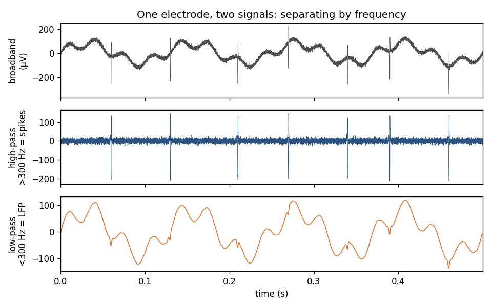

# Microelectrode recordings: spikes and the LFP

> **Goal of this page.** Build the physical and conceptual picture of what a
> microelectrode records, so the rest of nSTAT (spike trains, GLMs, LFP
> spectra, decoding) has a concrete grounding. No prior neuroscience
> assumed.

## What a microelectrode measures

A neuron at rest holds a voltage difference across its membrane. When it
fires an **action potential** ("spike"), ions flow across the membrane, and
those currents spread through the conductive extracellular fluid. A thin
metal or silicon **microelectrode** placed in the tissue measures the tiny
voltage these currents produce at its tip, relative to a distant reference.

The recorded voltage is a *sum* of contributions from many sources near the
electrode. The key insight — explained thoroughly in
[Buzsáki, Anastassiou & Koch (2012)](https://pubmed.ncbi.nlm.nih.gov/22595786/) —
is that these contributions separate cleanly **by frequency**:

| Band (approx.) | Name | Physical origin | What it tells you |
|---|---|---|---|
| ~300 Hz – 5 kHz (high-pass) | **Spikes** / "unit activity" | Fast action-potential currents of nearby neurons | *When* individual neurons fire |
| ~1 – 300 Hz (low-pass) | **Local field potential (LFP)** | Slower, summed synaptic & subthreshold currents of a local population | Coordinated population activity, rhythms |



*One simulated electrode signal (top) split by frequency: high-pass (>300 Hz)
isolates the fast spike transients (middle); low-pass (<300 Hz) leaves the
slower LFP (bottom).*

So a single broadband electrode signal gives you **two complementary views**
through two filters: high-pass it and you see spikes; low-pass it and you see
the LFP. nSTAT has tools for both:

- Spikes → `nspikeTrain`, `SpikeTrainCollection`, point-process GLMs
  (see [Spike trains and point-process GLMs](spike_trains_and_glms.md)).
- LFP → `SignalObj` with multitaper spectra, spectrograms, and Kalman
  filtering (see [The LFP and spectral analysis](lfp_and_spectral.md)).

## From voltage to spike times: detection and sorting

nSTAT analyzes **spike trains** — lists of times at which a neuron fired — not
raw voltage. Getting from the broadband trace to spike trains is a separate
pre-processing pipeline:

1. **Detection.** High-pass filter the signal and mark threshold crossings;
   each crossing is a candidate spike waveform snippet.
2. **Feature extraction.** Reduce each snippet to a few numbers (e.g. PCA
   scores or wavelet coefficients).
3. **Sorting / clustering.** Group snippets by waveform shape. Because each
   neuron has a characteristic waveform at a given electrode, clusters
   correspond (approximately) to individual neurons. See
   [Lewicki (1998)](https://pubmed.ncbi.nlm.nih.gov/10221571/) for the
   classic review and
   [Quian Quiroga et al. (2004)](https://pubmed.ncbi.nlm.nih.gov/15228749/)
   for a popular wavelet-based method.

**Single unit vs. multi-unit.** A well-isolated cluster is a *single unit*
(one putative neuron). When clusters can't be separated, the pooled
threshold crossings are *multi-unit activity (MUA)*. Multi-electrode arrays
(e.g. tetrodes) improve separation by viewing each spike from several nearby
contacts.

> **nSTAT's starting point.** nSTAT assumes detection and sorting are already
> done — it consumes spike times. To go from raw acquisition files to sorted
> spikes, use a dedicated tool such as
> [SpikeInterface](https://github.com/SpikeInterface/spikeinterface), then
> bring the results into nSTAT via the
> [interop bridges](../extras.rst) (`nstat.extras.interop.neo` / `.nwb` /
> `.pynapple`).

**Sorting is imperfect**, and the errors matter.
[Harris et al. (2000)](https://pubmed.ncbi.nlm.nih.gov/10899214/) showed,
using simultaneous intracellular ground truth, that even good tetrode sorting
misassigns a non-trivial fraction of spikes. This is exactly the motivation
for **clusterless decoding**, which skips the hard sorting step and decodes
directly from spike *features* — see
[Goodness-of-fit and decoding](goodness_of_fit_and_decoding.md).

## Building a spike train in nSTAT

Once you have spike times (in seconds), wrap them in an `nspikeTrain`:

```python
import numpy as np
from nstat import nspikeTrain

# Spike times (s) for one sorted unit, e.g. from your sorter's output.
spike_times = np.array([0.012, 0.047, 0.071, 0.130, 0.205])

st = nspikeTrain(
    spike_times,
    name="unit01",
    sampleRate=1000,   # Hz; sets the discretization grid (1 ms bins here)
    minTime=0.0,
    maxTime=0.25,
)
print(st.n_spikes, "spikes")
st.plot()   # raster tick marks
```

A `SpikeTrainCollection` (`nstColl`) groups units recorded together — the
natural object for population analyses and ensemble GLM terms.

```python
from nstat import nstColl
population = nstColl([st])          # add more nspikeTrains for an ensemble
population.setMinTime(0.0)
population.setMaxTime(0.25)
```

## Why model spike trains statistically?

A spike train looks deterministic (a neuron either fired or it didn't), but
repeated trials of the "same" stimulus produce *different* spike times. The
productive view, formalized by
[Truccolo et al. (2005)](https://pubmed.ncbi.nlm.nih.gov/15356183/), is that
spikes are samples from a **point process** whose instantaneous firing rate
depends on the stimulus, the neuron's own recent history, and the rest of the
ensemble. Estimating that rate function is what nSTAT's GLMs do, and it is the
subject of the [next page](spike_trains_and_glms.md).

As recording counts climb into the hundreds and thousands of simultaneous
neurons, principled statistical models — rather than trial-averaged tuning
curves — become essential
([Stevenson & Kording 2011](https://pubmed.ncbi.nlm.nih.gov/21270781/)).

## Check your understanding

1. You have a broadband electrode trace and want the LFP. What do you do, and
   roughly which frequency band do you keep?
2. Your sorter returns a cluster you cannot cleanly separate. Is that a single
   unit or multi-unit activity — and can nSTAT still analyze it?

<details>
<summary>Show answers</summary>

1. **Low-pass filter** the signal, keeping roughly **1–300 Hz**; the
   high-frequency (>300 Hz) part holds the spikes.
2. It is **multi-unit (or unsorted) activity**. nSTAT can analyze any list of
   spike times, but interpreting results as a *single neuron* requires a
   well-isolated unit.

</details>

## See also

- Runnable example: building and rastering spike trains —
  [`examples/readme_examples/example3_nstcoll_raster_from_example2.py`](https://github.com/cajigaslab/nSTAT-python/blob/main/examples/readme_examples/example3_nstcoll_raster_from_example2.py)
- Notebook: [`nSpikeTrainExamples.ipynb`](https://github.com/cajigaslab/nSTAT-python/blob/main/notebooks/nSpikeTrainExamples.ipynb)
- API: `nspikeTrain`, `SpikeTrainCollection`, `nstColl` in the
  [API reference](../api.rst)
- [Glossary](glossary.md) · [Bibliography](bibliography.md)
