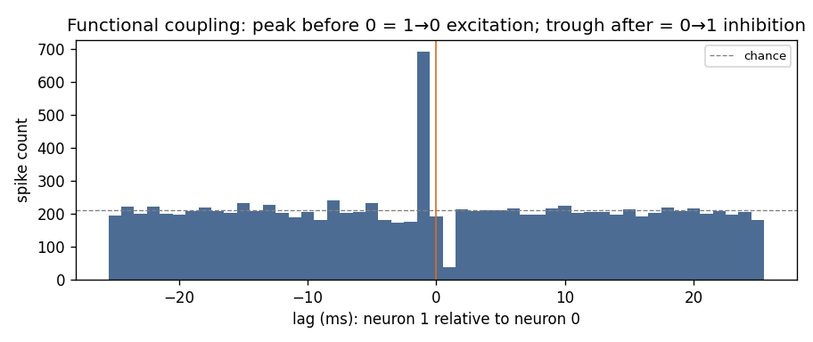

# Network connectivity and functional coupling

> **Goal of this page.** Move from single neurons to **interactions**: how one
> neuron's spikes influence another's, how nSTAT estimates that coupling, and
> the classic trap of mistaking shared input for a connection.
>
> **Glossary jumps:** [ensemble / functional coupling](glossary.md#ensemble-functional-coupling) ·
> [GLM](glossary.md#generalized-linear-model) ·
> [CIF](glossary.md#conditional-intensity-function) ·
> [history / refractory](glossary.md#history-term-refractory-period) ·
> [point process](glossary.md#point-process)

Builds on the [point-process GLM](spike_trains_and_glms.md).

## Neurons are not independent

A neuron's firing depends not only on the stimulus and its own history, but on
**other neurons**. The point-process GLM already has a slot for this — the
**ensemble** term on the [GLM page](spike_trains_and_glms.md):

$$
\log \lambda_{i}(t \mid H_t) \;=\; \cdots \;+\; \sum_{j} \eta_{ij}\, n_j(t - \tau).
$$

The term $n_j(t - \tau)$ is neuron $j$'s recent spiking, and $\eta_{ij}$
measures how it raises ($\eta > 0$, excitation) or lowers ($\eta < 0$,
inhibition) neuron $i$'s firing, **beyond** what the shared stimulus explains. This is *functional* (statistical)
coupling — not necessarily a direct synapse, but a directed predictive
relationship ([Truccolo et al. 2005](https://pubmed.ncbi.nlm.nih.gov/15356183/)).

## Two ways to see coupling

**1. The cross-correlogram (CCG) — model-free.**
Count how much more (or less) likely neuron *j* is to fire at each time lag
relative to a neuron *i* spike. Excitation appears as a **bump**, inhibition as
a **trough**, and the **side** of zero tells you the direction (who leads).

*Two simulated neurons wired asymmetrically — neuron 1 **excites** neuron 0
(peak just before lag 0: neuron 1 leads) while neuron 0 **inhibits** neuron 1
(trough just after lag 0). You cannot read this directed, signed wiring from
firing rates alone.*

**2. The coupling GLM — model-based.**
Fit each neuron's firing with the *other* neuron's recent spikes as a covariate;
the sign and size of the fitted $\eta$ quantify the coupling. The runnable
[network-coupling tutorial](https://github.com/cajigaslab/nSTAT-python/blob/main/examples/tutorials/network_coupling.py)
recovers exactly the asymmetric excite/inhibit wiring above (≈ +1.3 and −1.7,
matching the simulated ±1.5).

## The big trap: correlation is not connection

Two neurons that share a **common input** (the same stimulus, a population
rhythm) will be correlated *even with no direct coupling at all*. A naive CCG or
a coupling GLM that omits the shared drive will report a spurious connection.

**The fix:** include the shared stimulus (and any common covariates) in the
model, so the ensemble term measures coupling *over and above* common input.
The tutorial does this explicitly — dropping the stimulus covariate flips one
of the recovered signs. This is the single most common mistake in connectivity
analysis; see also [Common pitfalls & FAQ](pitfalls_and_faq.md).

## Continuous signals: Granger causality

The same logic extends to **continuous** signals (e.g. LFP channels). nSTAT's
`Analysis` provides **ensemble Granger causality**: signal *X* "Granger-causes"
*Y* if *X*'s past improves the prediction of *Y* beyond *Y*'s own past. It is the
continuous-signal analogue of the ensemble coupling terms above, and shares the
same common-input caveat — a third signal driving both can manufacture an
apparent causal link.

## Check your understanding

1. A CCG shows a trough just *after* lag 0 (neuron *j* after neuron *i*). What
   coupling does that suggest, and in which direction?
2. Two neurons are strongly correlated. Why is that not enough to claim they
   are connected?

Show answers

1. **Inhibition from *i* to *j*** — neuron *i*'s spike makes *j* less likely to
   fire shortly after. The post-zero side indicates *i* leads *j*.
2. They may share a **common input** (stimulus or rhythm) that makes them
   co-vary with no direct coupling. You must **condition on the shared drive**
   before attributing correlation to a connection.

## See also

- Runnable tutorial (no data needed):
  [`examples/tutorials/network_coupling.py`](https://github.com/cajigaslab/nSTAT-python/blob/main/examples/tutorials/network_coupling.py)
- Notebook: [`NetworkTutorial.ipynb`](https://github.com/cajigaslab/nSTAT-python/blob/main/notebooks/NetworkTutorial.ipynb)
- API: `Analysis` (Granger causality), `TrialConfig` (`ensCovHist` ensemble
  terms), `simulate_two_neuron_network` in the [API reference](../api.rst)
- [Glossary](glossary.md) · [Bibliography](bibliography.md)
