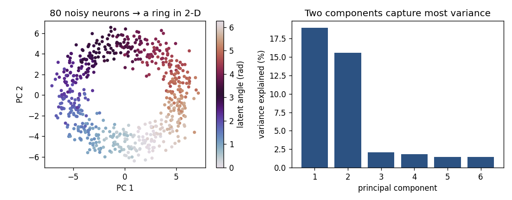

# Population geometry: from single neurons to neural manifolds

> **Goal of this page.** nSTAT's models describe **one neuron at a time** (its
> conditional intensity) or **pairs** (functional coupling). Modern systems
> neuroscience adds a complementary view: treat the population's activity as a
> single high-dimensional object and ask about its **geometry**. This page is
> the on-ramp — it shows the core idea with a few lines of NumPy and points to
> the standard tooling that takes it further.

## Why look at the population as a whole

A point-process GLM answers "what drives *this* neuron?" But behavior and
computation are carried by **populations**, and the population's activity is
usually far simpler than its neuron count suggests. If you record 80 neurons,
the activity does **not** fill all 80 dimensions — it is confined to a
low-dimensional surface, a **neural manifold**, shaped by the variables the
circuit actually represents
([Gallego et al. 2017](https://pubmed.ncbi.nlm.nih.gov/28595054/)).

The simplest window onto that structure is **principal component analysis
(PCA)**: rotate the population's activity to the axes of greatest variance and
keep the first few.



*Eighty neurons, each cosine-tuned to one hidden angle (think head direction),
fire as the latent variable travels around a circle. Their Poisson spike counts
live in an 80-dimensional space — yet PCA reveals that the activity traces a
**ring** in just two dimensions, with the latent angle running smoothly around
it (color). The scree plot confirms two components capture most of the
variance. The high-dimensional recording has a low-dimensional heart.*

You can reproduce the essential computation directly from binned population
counts — no new toolbox required:

```python
import numpy as np

# counts: (T time bins) x (N neurons) spike-count matrix
Z = (counts - counts.mean(0)) / (counts.std(0) + 1e-9)   # z-score per neuron
U, S, Vt = np.linalg.svd(Z - Z.mean(0), full_matrices=False)
pcs = U[:, :2] * S[:2]                 # population trajectory in 2-D
var_explained = S**2 / np.sum(S**2)    # how flat is the manifold?
```

This connects straight back to nSTAT: the place-cell capstone already builds a
population spike-count matrix
([`place_cell_walkthrough.py`](https://github.com/cajigaslab/nSTAT-python/blob/main/examples/tutorials/place_cell_walkthrough.py)),
and decoding *is* the inverse question — reading the latent variable back off
the manifold.

## How this relates to nSTAT's tools

| Question | nSTAT today | Population-geometry view |
|---|---|---|
| What drives one neuron? | point-process GLM (CIF) | a single axis of the manifold |
| How do two neurons relate? | coupling / CCG / Granger | local curvature of the manifold |
| What is the latent state? | PPAF / SSGLM (model-based) | low-dim coordinates (data-driven) |

The **state-space** models nSTAT already implements
([SSGLM, EM](state_space_and_em.md)) and the manifold view are two routes to the
same destination — a low-dimensional latent that explains many neurons. nSTAT's
route is *model-based* (you write down a CIF and infer the state with a filter);
the manifold route is *data-driven* (you let variance find the axes). Each is
strongest where the other is weak.

## Where to learn more

nSTAT does not ship the dimensionality-reduction methods beyond this PCA
sketch — that is deliberate. The standard references and tooling:

- **Gaussian-Process Factor Analysis (GPFA)** — smooth, single-trial latent
  trajectories, the workhorse beyond raw PCA
  ([Yu et al. 2009](https://pubmed.ncbi.nlm.nih.gov/19357332/)).
- **The dimensionality-reduction toolbox** — factor analysis, demixed PCA,
  nonlinear embeddings; what each is for and how to choose
  ([Cunningham & Yu 2014](https://pubmed.ncbi.nlm.nih.gov/25151264/)).
- **Computation through dynamics** — reading the manifold as the state space of
  a dynamical system the circuit implements
  ([Vyas et al. 2020](https://pubmed.ncbi.nlm.nih.gov/32640928/)).

From there the arc continues into deep-learning models of population activity —
see [from filters to deep learning](from_filters_to_deep_learning.md) — and the
[further-study page](further_study.md) collects pointers to the topics
this toolbox does not implement.

## Check your understanding

1. You record 100 neurons but a scree plot shows the first 3 PCs capture 90% of
   the variance. What does that tell you about the population?
2. Why might a *data-driven* latent (PCA/GPFA) and a *model-based* latent
   (SSGLM/PPAF) disagree, and is that a problem?

<details>
<summary>Show answers</summary>

1. The population's activity is **low-dimensional**: despite 100 neurons, the
   coordinated activity lives on roughly a 3-D manifold. The circuit is
   representing only a few underlying variables, and the neurons are correlated
   views of them.
2. They optimize different things. PCA/GPFA find the axes of greatest
   **variance** with no model of *why* neurons spike; SSGLM/PPAF infer the state
   that best explains spiking under an **explicit encoding model**. They can
   differ when high-variance activity is not the behaviorally relevant signal.
   It is not a problem — it is informative: agreement is reassuring, and
   disagreement flags that variance and task-relevance are not the same thing.

</details>

## See also

- [State-space models and EM](state_space_and_em.md) — the model-based route to
  a latent state.
- [Goodness-of-fit and decoding](goodness_of_fit_and_decoding.md) — decoding is
  reading the latent variable off the population.
- [From filters to deep learning](from_filters_to_deep_learning.md) — what comes
  after linear manifolds.
