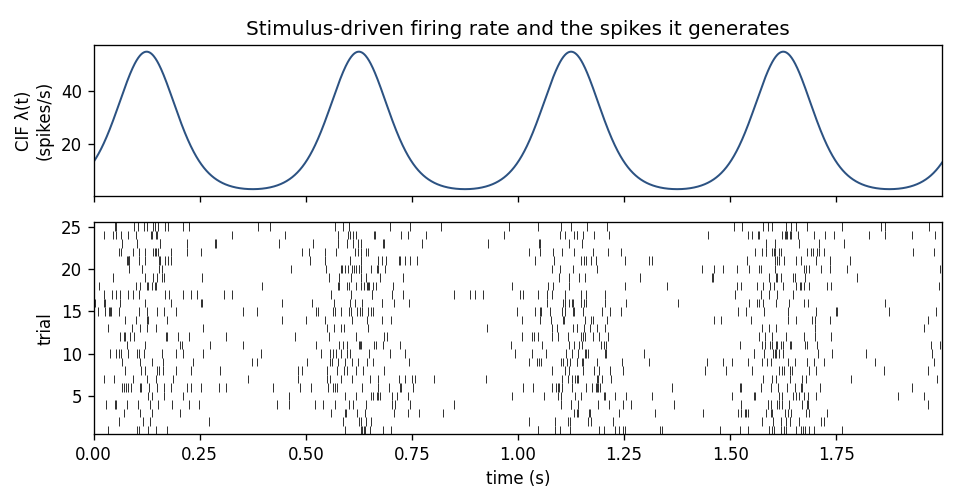
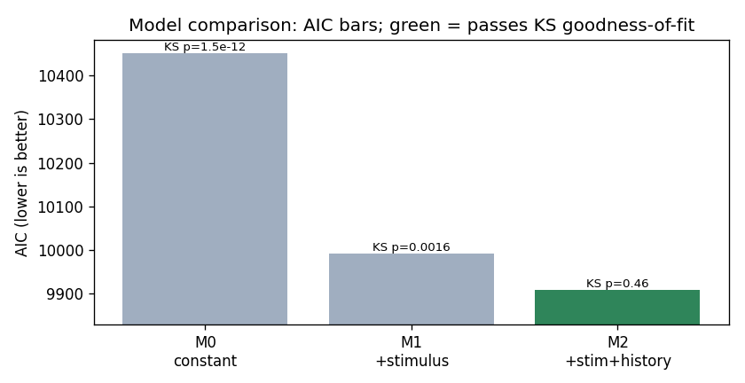

# Spike trains and point-process GLMs

> **Goal of this page.** Explain spike trains as *point processes*, the
> *conditional intensity function* (CIF) that defines them, and how nSTAT
> fits CIFs with *point-process generalized linear models* (GLMs).
>
> **Glossary jumps:** [point process](glossary.md#point-process) ·
> [CIF](glossary.md#conditional-intensity-function) ·
> [GLM](glossary.md#generalized-linear-model) ·
> [link function](glossary.md#link-function) ·
> [history / refractory](glossary.md#history-term-refractory-period) ·
> [AIC / BIC](glossary.md#aic-bic) ·
> [SSGLM](glossary.md#state-space-glm)

## Spike trains as point processes

A **point process** is a probabilistic model for a series of events in time —
here, spike times. Instead of predicting a continuous waveform, it predicts
*when* discrete events happen. The complete statistical description of a
point process is its **conditional intensity function (CIF)**, written
`λ(t | H_t)`:

> `λ(t | H_t) · Δ` ≈ the probability of a spike in the small interval
> `[t, t+Δ)`, given the history `H_t` of everything observed up to time `t`.

Intuitively, `λ(t | H_t)` is an *instantaneous firing rate* (in spikes/s)
that is allowed to depend on the past. The dependence on history `H_t` is what
makes the CIF powerful: it captures refractoriness, bursting, and
network coupling that a plain rate `λ(t)` cannot. See
[Daley & Vere-Jones (2003)](https://doi.org/10.1007/b97277) for the theory and
[Truccolo et al. (2005)](https://pubmed.ncbi.nlm.nih.gov/15356183/) for the
neuroscience framing.



*Top: a conditional intensity function `λ(t)` driven by a stimulus. Bottom:
spikes simulated from it on 25 repeated trials — different every time, but
denser wherever `λ(t)` is high. The point process is the bridge between the
two.*

Special cases worth naming:

- **Homogeneous Poisson:** `λ` constant. Spikes are "completely random" at a
  fixed rate; no history dependence.
- **Inhomogeneous Poisson:** `λ(t)` varies with time (e.g. driven by a
  stimulus) but still ignores history.
- **History-dependent (renewal and beyond):** `λ(t | H_t)` depends on the
  time since the last spike(s) — the regime real neurons live in.

## The point-process GLM

How do we *estimate* $\lambda(t \mid H_t)$ from data? nSTAT uses a
**generalized linear model**: model the **log** of the CIF as a linear
combination of covariates,

$$
\begin{aligned}
\log \lambda(t \mid H_t) \;=\; \beta_0
  &\;+\; \underbrace{\sum_{k} \beta_{k}\, s_{k}(t)}_{\text{stimulus / extrinsic covariates}} \\
  &\;+\; \underbrace{\sum_{j} \gamma_{j}\, n(t - \tau_{j})}_{\text{the neuron's own spike history}} \\
  &\;+\; \underbrace{\sum_{i} \eta_{i}\, n_{\text{ensemble},\,i}(t)}_{\text{other neurons (ensemble)}}.
\end{aligned}
$$

Each term answers a scientific question:

- **Stimulus terms `s_k(t)`** — how does an external covariate (a sensory
  stimulus, a movement, the animal's position) drive firing? Often expanded
  in a spline or other basis so the tuning can be nonlinear.
- **History terms `n(t − τ_j)`** — how does the neuron's own recent spiking
  shape its firing? Negative `γ` near zero lag captures the refractory
  period; positive lobes capture bursting.
- **Ensemble terms** — does another neuron's firing predict this one's,
  beyond the shared stimulus? This is functional coupling.

Using the **log link** guarantees `λ > 0` (a rate can't be negative) and makes
the model *multiplicative* in the covariates. A central practical fact:
the point-process GLM log-likelihood is **concave**
([Paninski 2004](https://pubmed.ncbi.nlm.nih.gov/15600233/)), so fitting has a
unique maximum and converges reliably — no local-minima roulette.

## Fitting a GLM in nSTAT

The objects involved:

- `nspikeTrain` / `nstColl` — the spike data (see
  [Microelectrode recordings](microelectrode_recordings.md)).
- `Covariate` / `CovColl` — the stimulus/covariate signals, sampled on a
  time grid.
- `TrialConfig` — *which* covariates, history windows, and ensemble terms to
  include, and the basis for each. This is your **model specification**.
- `Trial` — bundles spikes + covariates + events for one experiment.
- `Analysis` — runs the fit; returns `FitResult` objects.

A minimal stimulus + history fit:

```python
import numpy as np
from nstat import (Trial, TrialConfig, ConfigColl, Covariate,
                   nstColl, nspikeTrain, Analysis)

# --- data: one unit, a 1 Hz sinusoidal stimulus over 2 s at 1 kHz ---
t = np.arange(0, 2.0, 1e-3)
stim = np.sin(2 * np.pi * 1.0 * t).reshape(-1, 1)
cov = Covariate(t, stim, name="stim", xlabelval="time", xunitval="s",
                ylabelval="amp", yunitval="a.u.", dataLabels=["stim"])

st = nspikeTrain(np.sort(np.random.default_rng(0).uniform(0, 2.0, 60)),
                 name="unit01", sampleRate=1000, minTime=0.0, maxTime=2.0)
pop = nstColl([st]); pop.setMinTime(0.0); pop.setMaxTime(2.0)
trial = Trial(pop, ev=None, covarColl=None, neighbors=None)

# --- model specification: baseline + stimulus (spline) + short history ---
cfg = TrialConfig(
    covariate_specs=[("Baseline", "constant"), ("stim", "spline")],
    sampleRate=1000,
    history_window_times=[0.001, 0.002, 0.005, 0.010],   # refractory + short
    ensCovHist=[],
)

results = Analysis.runAnalysisForAllNeurons(trial, ConfigColl([cfg]))
fit = results[0][0]
print(f"AIC = {fit.AIC:.1f}")
```

`FitResult` exposes the fitted coefficients, their confidence intervals, the
estimated CIF, and goodness-of-fit diagnostics.

## Model comparison: which covariates earn their place?

More covariates always fit the training data better, so nSTAT scores models
by **penalized likelihood** — Akaike's `AIC` and the Bayesian `BIC`
(`fit.AIC`, `fit.BIC`) — which trade fit against the number of parameters.
The workflow is: specify several `TrialConfig`s (e.g. *stimulus only* vs.
*stimulus + history*), fit all of them, and prefer the lowest AIC/BIC **that
also passes goodness-of-fit** (next page). A model can win on AIC and still be
wrong — always check the KS plot.



*Three nested models of a neuron with a stimulus drive **and** a refractory
period. AIC falls as terms are added, but only the full **stimulus + history**
model passes the KS goodness-of-fit test (green) — the constant and
stimulus-only models are rejected despite their lower-but-not-lowest AIC. The
runnable [model-comparison tutorial](https://github.com/cajigaslab/nSTAT-python/blob/main/examples/tutorials/model_comparison.py)
also reports each coefficient with a 95% confidence interval.*

## Across-trial dynamics: the state-space GLM (SSGLM)

The GLM above assumes the tuning is fixed. During *learning*, tuning changes
trial to trial. The **state-space GLM** treats the GLM coefficients as a
latent state that evolves across trials, estimated by an EM algorithm
([Smith & Brown 2003](https://pubmed.ncbi.nlm.nih.gov/12803953/)). In nSTAT
this is `nstColl.ssglm()` / `ssglmFB()` (forward–backward). Paper Example 03
walks through it.

## Check your understanding

1. In words, what does `λ(t | H_t) · Δ` represent?
2. Why does the GLM model `log λ` (a log link) rather than `λ` directly?

<details>
<summary>Show answers</summary>

1. The **probability of a spike** in the small interval `[t, t+Δ)`, **given
   the history** `H_t` of past spikes and covariates.
2. The log link keeps the rate **positive**, makes covariates act
   **multiplicatively**, and yields a **concave** log-likelihood
   ([Paninski 2004](https://pubmed.ncbi.nlm.nih.gov/15600233/)) so the fit has a
   unique optimum.

</details>

> **Applying nSTAT — rhythmic and tremor cells.** A covariate need not be an
> external stimulus. A neuron with its own *rhythm* — for example a **tremor
> cell** locked to a few-hertz limb tremor in the human subthalamic nucleus
> ([Levy et al. 2000](https://pubmed.ncbi.nlm.nih.gov/11027240/)) — is captured
> by the *same* GLM with a **periodic covariate** at the rhythm's frequency.
> See [Rhythmic firing and the clinical
> microelectrode](rhythmic_firing_and_clinical_microelectrode.md).

## See also

- Runnable examples:
  [`examples/fit_poisson_glm.py`](https://github.com/cajigaslab/nSTAT-python/blob/main/examples/fit_poisson_glm.py),
  Paper Example 02 (stimulus + history) and 03 (SSGLM).
- Notebooks:
  [`AnalysisExamples.ipynb`](https://github.com/cajigaslab/nSTAT-python/blob/main/notebooks/AnalysisExamples.ipynb),
  [`HistoryExamples.ipynb`](https://github.com/cajigaslab/nSTAT-python/blob/main/notebooks/HistoryExamples.ipynb)
- API: `Analysis`, `TrialConfig`, `FitResult`, `CIF`, `fit_poisson_glm` in
  the [API reference](../api.rst)
- Next: [Goodness-of-fit and decoding](goodness_of_fit_and_decoding.md) ·
  [Glossary](glossary.md) · [Bibliography](bibliography.md)
