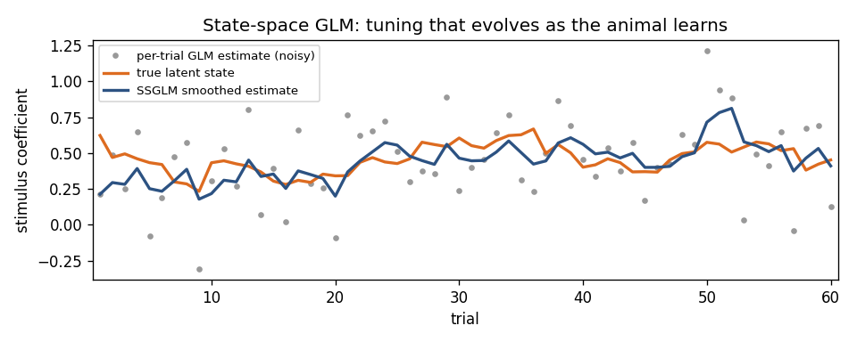

# State-space models: learning dynamics and EM

> **Goal of this page.** Go beyond the *static* encoding GLM to models whose
> parameters **change over time** — across trials as an animal learns, or
> within a trial as a latent brain state evolves. These are *state-space*
> models, fit by the EM algorithm.

This page assumes the [point-process GLM](spike_trains_and_glms.md) and the
[decoding](goodness_of_fit_and_decoding.md) pages.

## Why a state space?

The GLM on the [spike-trains page](spike_trains_and_glms.md) assumes a neuron's
tuning is **fixed** for the whole recording. That is often false:

- During **learning**, the stimulus→firing relationship changes trial by trial.
- Within a trial, an unobserved **latent state** (attention, motor plan,
  position) drives firing and itself evolves smoothly in time.

A **state-space model** has two layers:

1. A **state equation** describing how a hidden state `xₜ` evolves
   (e.g. a random walk `xₜ = A·xₜ₋₁ + noise`).
2. An **observation equation** linking the state to what we measure — here,
   spikes via a point-process GLM whose parameters depend on `xₜ`.

The job is to estimate the *trajectory* of the hidden state (and the model
parameters) from the spikes alone.

## Two flavors in nSTAT

**1. Across-trial learning — the state-space GLM (SSGLM).**
The GLM coefficients themselves become the latent state and are allowed to
drift from trial to trial. This captures *plasticity*: how tuning sharpens or
shifts as the animal learns. The estimator is an
**expectation–maximization (EM)** algorithm with a forward–backward (Kalman)
smoother over trials
([Smith & Brown 2003](https://pubmed.ncbi.nlm.nih.gov/12803953/)). In nSTAT:

```python
# population is an nstColl of spike trains, one per trial/neuron;
# cfg is a TrialConfig as on the GLM page.
result = population.ssglm(...)      # forward filter
result = population.ssglmFB(...)    # forward-backward smoother (recommended)
```



*Why a state space helps: the true tuning (orange) drifts as the animal learns.
Fitting each trial independently is noisy (grey); the SSGLM smoother (blue)
borrows strength across trials to recover the trajectory.*

Paper Example 03 walks through SSGLM end to end on PSTH-style data.

**2. Within-recording latent state — adaptive filtering / EM-trained SSMs.**
When the latent state evolves *within* a recording, you either (a) *decode* it
online with the point-process adaptive filter (the
[decoding page](goodness_of_fit_and_decoding.md);
[Eden et al. 2004](https://pubmed.ncbi.nlm.nih.gov/15070506/)), or (b) *learn*
the state-space model's parameters with EM when they are unknown.

For (b), the opt-in `nstat.extras.em.dynamax_bridge` provides modern
EM trainers for linear-Gaussian, point-process, and hybrid state-space models
(the `KF_EM` / `PP_EM` / `mPPCO_EM` family), built on Dynamax (JAX). It adds
held-out **predictive log-likelihood** for honest model comparison and a
**multi-restart** workflow that is the recommended way to fit on real data:

```python
from nstat.extras.em.dynamax_bridge import fit_point_process_em_best_of

result = fit_point_process_em_best_of(
    spike_counts, state_dim=3, n_restarts=8, holdout_fraction=0.2,
    init="log_empirical_rate",   # data-driven initialization
    ridge_lambda=0.5,            # stabilizes the transition estimate
)
result.best_predictive_ll        # held-out log-likelihood of the winner
```

> **Why multi-restart + held-out scoring?** EM finds a *local* optimum, and
> point-process state-space EM has a weak-observability failure mode where the
> transition collapses. Fitting several random restarts and keeping the one
> with the best **held-out** predictive log-likelihood avoids reporting a
> degenerate fit. See the
> [EM extras guide](../extras/em_dynamax.md) for the full caveats.

> **Applying nSTAT — the electrode descent as an evolving latent state.** Both
> flavors above have a clinical reading. The intraoperative microelectrode
> descent is a *within-recording* latent state: as the tip advances, the
> structure it sits in changes, and the firing-rate / variability / spectral
> summary jumps at each **nucleus boundary** — a change-point on a latent
> depth-region track that the state-space estimators here are built to follow
> ([Hutchison et al. 1998](https://pubmed.ncbi.nlm.nih.gov/9778260/);
> [Zaidel et al. 2010](https://pubmed.ncbi.nlm.nih.gov/20534648/)). The
> *across-trial* SSGLM has the longitudinal analogue: a coefficient that drifts
> as an animal learns is the same machinery you would use to track a slowly
> evolving disease or therapy-response state across sessions. See
> [Rhythmic firing and the clinical
> microelectrode](rhythmic_firing_and_clinical_microelectrode.md).

## A note on networks and causality

The same statistical machinery underlies **functional connectivity**. Ensemble
terms in the GLM (the spike-trains page) already capture one neuron's influence
on another. For directed, frequency-resolved interactions between continuous
signals (e.g. LFP channels), nSTAT's `Analysis` provides **Granger causality**
over an ensemble — the continuous-signal analogue of the coupling terms in the
point-process GLM.

## Check your understanding

1. When would you choose the state-space GLM over a plain (static) GLM?
2. Why does point-process EM (`PP_EM`) use multiple restarts with held-out
   scoring instead of a single fit?

<details>
<summary>Show answers</summary>

1. When the tuning **changes over time** — e.g. across trials as the animal
   **learns or adapts**. The SSGLM lets the coefficients evolve as a latent
   state.
2. EM converges only to a **local** optimum and point-process state-space EM
   has a **collapse** failure mode. Several restarts scored by **held-out
   predictive log-likelihood** pick a non-degenerate fit.

</details>

## See also

- Runnable example: SSGLM across-trial dynamics — Paper Example 03
  [`examples/paper/example03_psth_and_ssglm.py`](https://github.com/cajigaslab/nSTAT-python/blob/main/examples/paper/example03_psth_and_ssglm.py)
- EM trainers (opt-in): the [EM extras guide](../extras/em_dynamax.md) and
  [`examples/extras/em_dynamax_demo.py`](https://github.com/cajigaslab/nSTAT-python/blob/main/examples/extras/em_dynamax_demo.py)
- Notebooks:
  [`AnalysisExamples2.ipynb`](https://github.com/cajigaslab/nSTAT-python/blob/main/notebooks/AnalysisExamples2.ipynb),
  [`HybridFilterExample.ipynb`](https://github.com/cajigaslab/nSTAT-python/blob/main/notebooks/HybridFilterExample.ipynb)
- API: `nstColl.ssglm`/`ssglmFB`, `DecodingAlgorithms`,
  `nstat.extras.em.dynamax_bridge` in the [API reference](../api.rst)
- [Glossary](glossary.md) · [Bibliography](bibliography.md)
