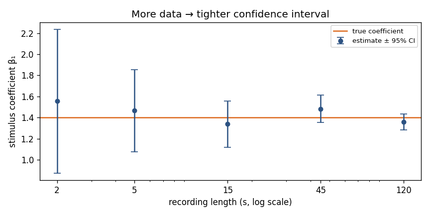
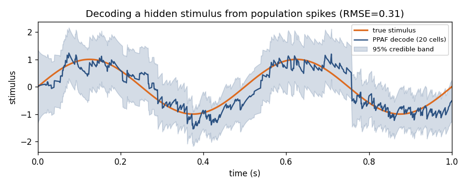

# Uncertainty and confidence intervals

> **Goal of this page.** Every number an analysis produces — a tuning
> coefficient, a firing rate, a decoded position — is an *estimate* from finite,
> noisy data. This page shows how nSTAT quantifies that uncertainty, and why an
> estimate without an interval is only half an answer.

## Why a point estimate is not enough

Suppose you fit a GLM and find a stimulus coefficient of `β₁ = 1.55`. Is the
neuron *really* stimulus-driven? It depends entirely on the **uncertainty**: if
the 95% confidence interval is `1.55 ± 0.10` the effect is solid; if it is
`1.55 ± 0.80` you have learned almost nothing. The same estimate supports
opposite conclusions depending on its interval. Reporting estimates without
intervals is the single most common way a spike-train analysis overstates what
the data show.

Uncertainty has one reliable cure: **more (and more informative) data**. As a
recording lengthens, the Fisher information accumulates and the interval
shrinks around the truth.



*The same neuron, analyzed from progressively longer recordings. Each estimate
(blue) brackets the true coefficient (orange) with its 95% interval, and the
interval narrows steadily with data. With only 2 s the data are consistent with
a wide range of tuning strengths; by 120 s the coefficient is pinned down.*

## Uncertainty in a GLM coefficient

For a point-process / Poisson GLM, the uncertainty of the fitted coefficients
comes from the **Fisher information** — the curvature of the log-likelihood at
the optimum. Sharply curved (well-identified) parameters have small standard
errors; flat directions have large ones. For the Poisson GLM with design matrix
`X` and fitted per-bin intensity `λ`, the information matrix and standard errors
are

```python
import numpy as np
from nstat import fit_poisson_glm

fit = fit_poisson_glm(X, y, offset=offset)
lam = fit.predict_rate(X, offset=offset)         # fitted intensity per bin

Xaug   = np.column_stack([np.ones(len(y)), X])    # include the intercept column
fisher = Xaug.T @ (lam[:, None] * Xaug)           # Xᵀ diag(λ) X
cov    = np.linalg.pinv(fisher)                   # parameter covariance
se     = np.sqrt(np.diag(cov))                    # standard errors

# 95% confidence interval for each coefficient:
beta   = np.concatenate([[fit.intercept], fit.coefficients])
ci_low, ci_high = beta - 1.96 * se, beta + 1.96 * se
```

A coefficient whose CI excludes 0 is "significant" at the 5% level; one whose CI
straddles 0 is not distinguishable from no effect. The worked
[model-comparison tutorial](https://github.com/cajigaslab/nSTAT-python/blob/main/examples/tutorials/model_comparison.py)
uses exactly this recipe to report every coefficient with its interval.

> **Watch the link function.** These intervals are on the **log-rate** scale
> (the GLM's linear predictor). To get an interval on the firing rate itself,
> transform the *endpoints* through `exp(·)` rather than adding a symmetric
> band to `exp(β)` — the rate interval is asymmetric.

## Uncertainty in a firing-rate curve

When you want a confidence band around a whole **firing-rate estimate** (a PSTH,
a tuning curve, a place field), nSTAT provides
`DecodingAlgorithms.computeSpikeRateCIs`, and `computeSpikeRateDiffCIs` for the
**difference** between two conditions (e.g. stimulus vs. baseline). The bounds
come back as a `ConfidenceInterval` object, which stores the lower/upper traces
on a shared time axis and knows how to plot itself as a line pair or a shaded
band.

## Uncertainty in a decode

Decoding is estimation too, so a decode also carries uncertainty. The
point-process adaptive filter (PPAF) propagates a **posterior covariance**
`Wₖ` alongside the state estimate `xₖ`: the square root of its diagonal is the
familiar 95% **credible band** around the decoded trajectory.



*The decode (blue) tracks the true stimulus (orange); the shaded band is the
filter's own 95% credible interval. The band widens when spikes are sparse and
tightens when the population is informative.* For the across-trial SSGLM,
`DecodingAlgorithms.ComputeStimulusCIs` builds the matching intervals (by Monte
Carlo for the full cross-trial covariance, or a Gaussian z-score approximation
for a smoother's output).

## Check your understanding

1. Two neurons both have stimulus coefficient `β₁ = 0.8`, but neuron A's 95% CI
   is `[0.6, 1.0]` and neuron B's is `[-0.3, 1.9]`. Which neuron is convincingly
   stimulus-driven?
2. You halve your recording length. Roughly what happens to the width of a
   coefficient's confidence interval?
3. Why is a 95% interval on a *firing rate* asymmetric even though the interval
   on the log-rate coefficient is symmetric?

<details>
<summary>Show answers</summary>

1. **Neuron A.** Its interval excludes 0, so the effect is reliably positive.
   Neuron B's interval straddles 0 — the data are consistent with no stimulus
   effect at all, despite the identical point estimate.
2. It roughly **grows by √2** (≈ 41% wider). Standard errors scale like
   `1/√(information)`, and information accumulates with data, so halving the
   data multiplies the interval width by about `√2`.
3. The rate is `exp(β)`, a nonlinear transform. Pushing the symmetric endpoints
   `β ± 1.96·se` through `exp(·)` stretches the upper side more than the lower,
   giving an **asymmetric** rate interval. Transform the endpoints, never add a
   symmetric band to `exp(β)`.

</details>

## See also

- Worked tutorial reporting coefficients with 95% CIs from the Fisher
  information —
  [`examples/tutorials/model_comparison.py`](https://github.com/cajigaslab/nSTAT-python/blob/main/examples/tutorials/model_comparison.py)
- [Goodness-of-fit and decoding](goodness_of_fit_and_decoding.md) — the credible
  band on a decode comes from the same posterior covariance.
- API: `DecodingAlgorithms.computeSpikeRateCIs`,
  `DecodingAlgorithms.computeSpikeRateDiffCIs`,
  `DecodingAlgorithms.ComputeStimulusCIs`, `ConfidenceInterval`.
- [Common pitfalls & FAQ](pitfalls_and_faq.md) — other ways an analysis can
  quietly mislead.
