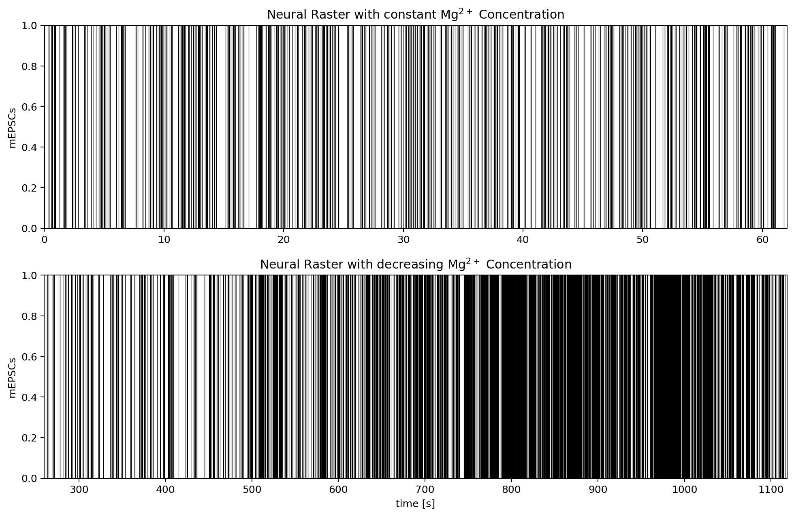
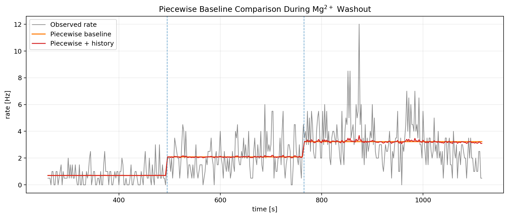

# example01

Generated figure outputs for `example01_mepsc_poisson`.

## Figures

### fig01_constant_mg_summary.png

### fig02_washout_raster_overview.png

### fig03_piecewise_baseline_comparison.png

