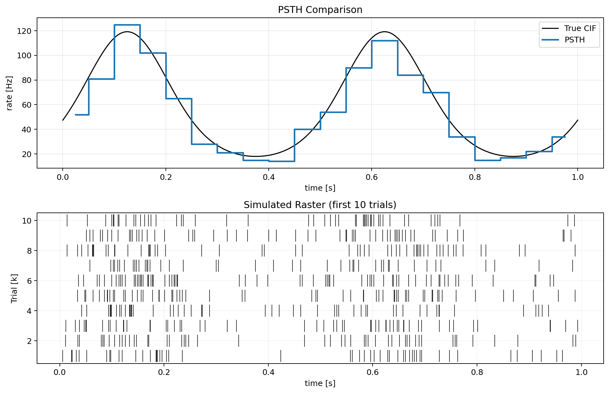
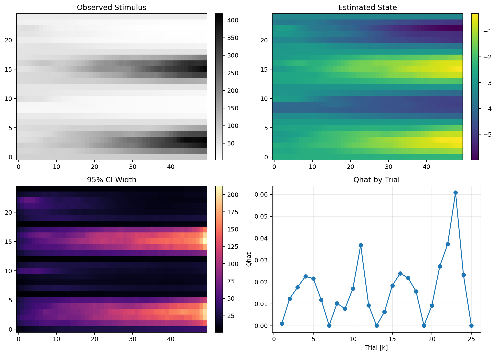
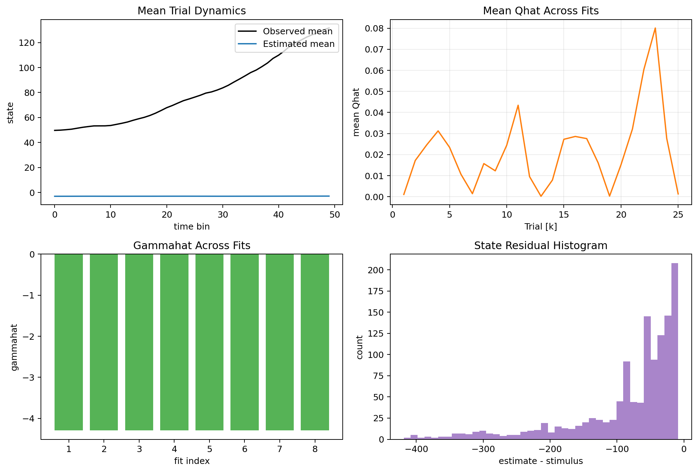
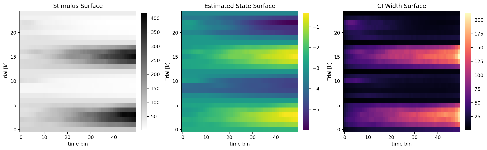
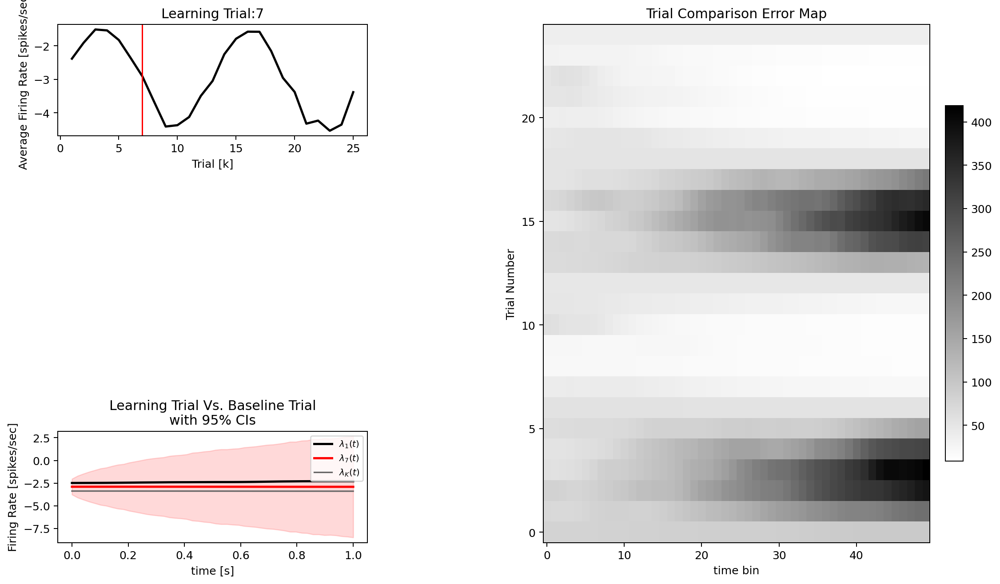

# example03

Generated figure outputs for `example03_psth_and_ssglm`.

## Figures

### fig01_simulated_and_real_rasters.png

### fig02_psth_comparison.png

### fig03_ssglm_simulation_summary.png

### fig04_ssglm_fit_diagnostics.png

### fig05_stimulus_effect_surfaces.png

### fig06_learning_trial_comparison.png

