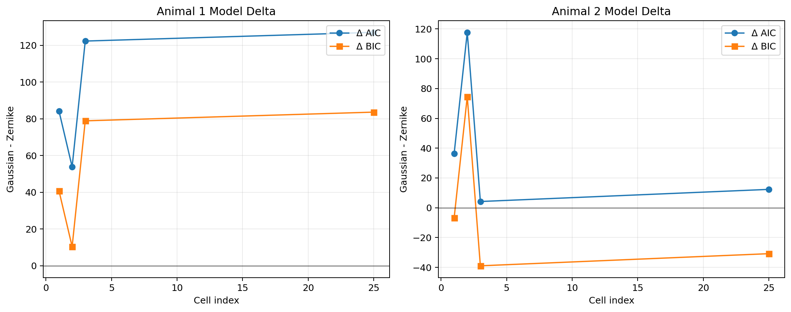
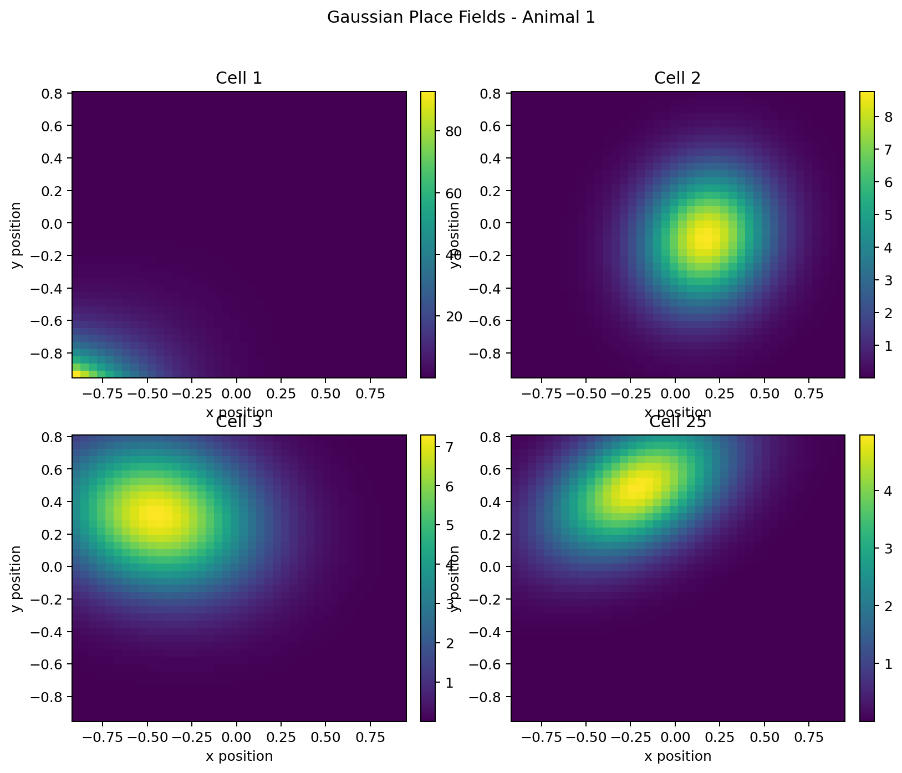
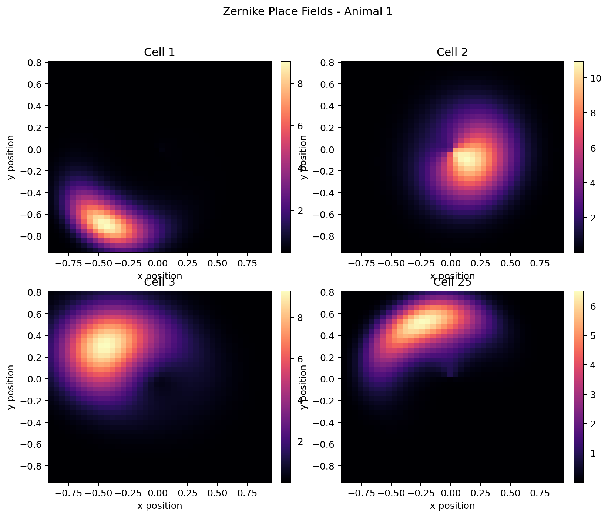
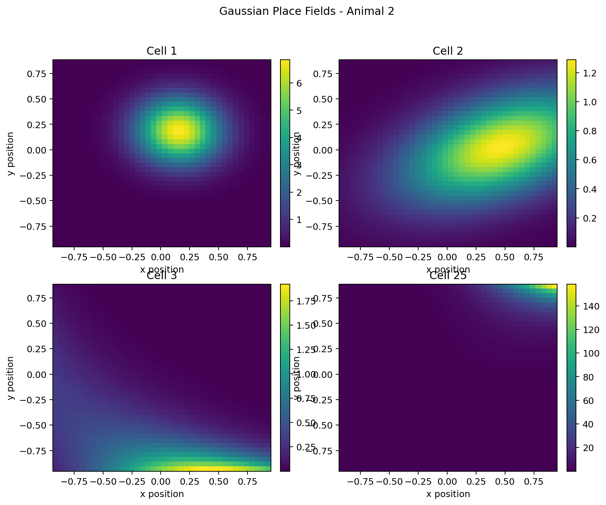
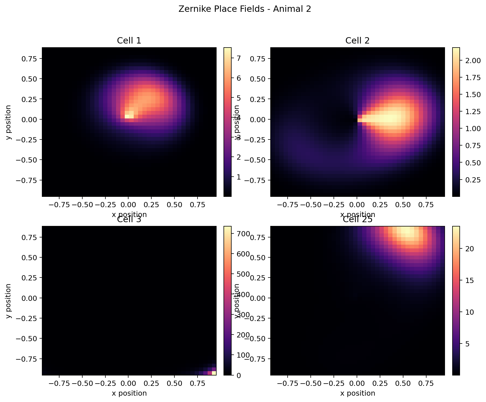
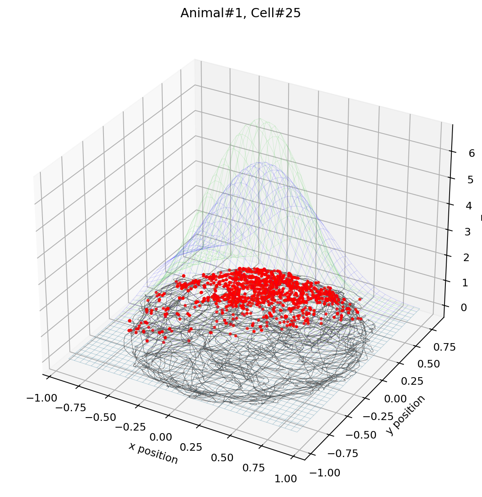

# example04

Generated figure outputs for `example04_place_cells_continuous_stimulus`.

## Figures

### fig01_example_cells_path_overlay.png

### fig02_model_summary_statistics.png

### fig03_gaussian_place_fields_animal1.png

### fig04_zernike_place_fields_animal1.png

### fig05_gaussian_place_fields_animal2.png

### fig06_zernike_place_fields_animal2.png

### fig07_example_cell_mesh_comparison.png

