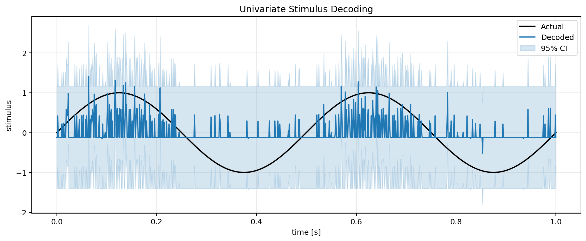
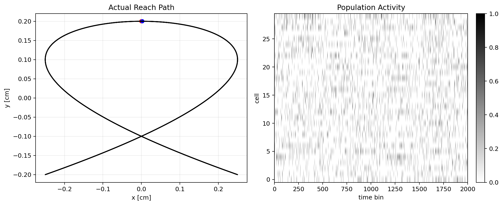
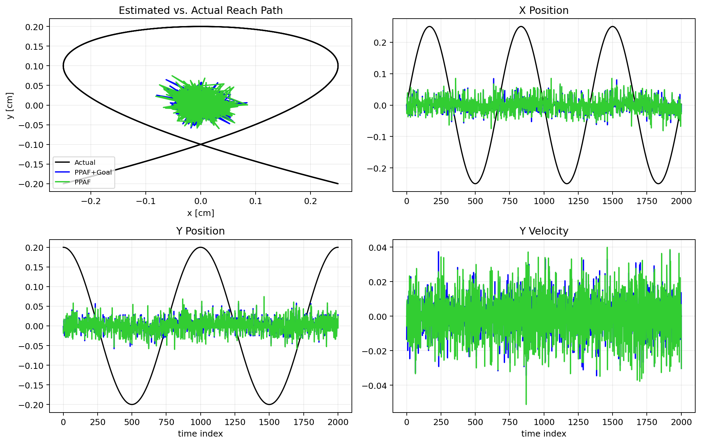
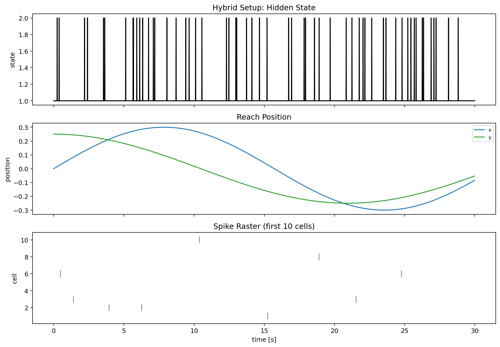
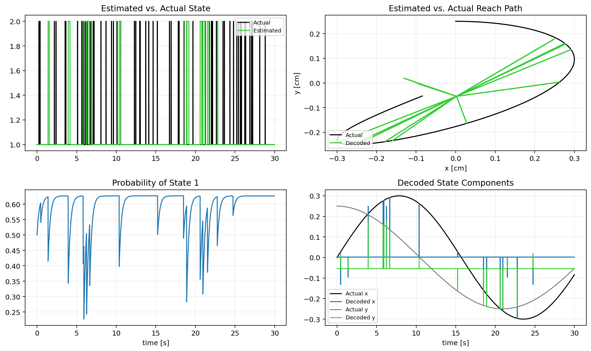

# example05

Generated figure outputs for `example05_decoding_ppaf_pphf`.

## Figures

### fig01_univariate_setup.png

### fig02_univariate_decoding.png

### fig03_reach_and_population_setup.png

### fig04_ppaf_goal_vs_free.png

### fig05_hybrid_setup.png

### fig06_hybrid_decoding_summary.png

