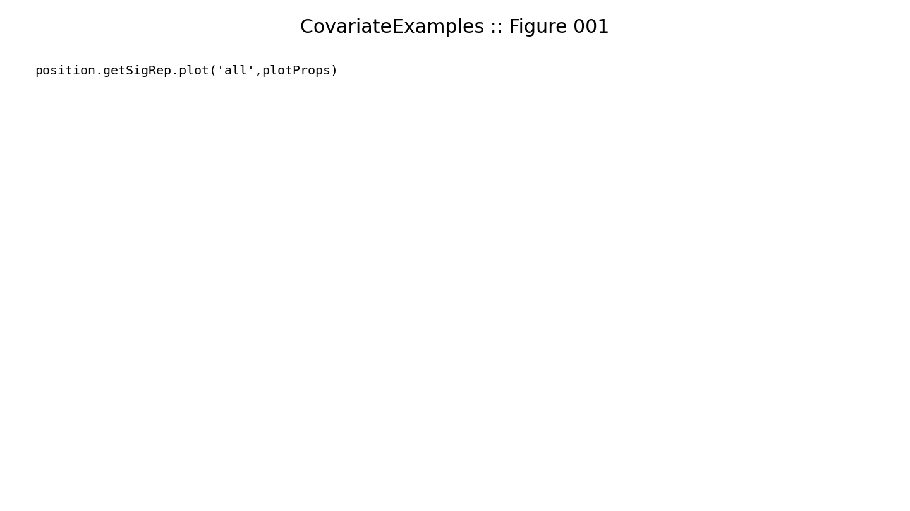
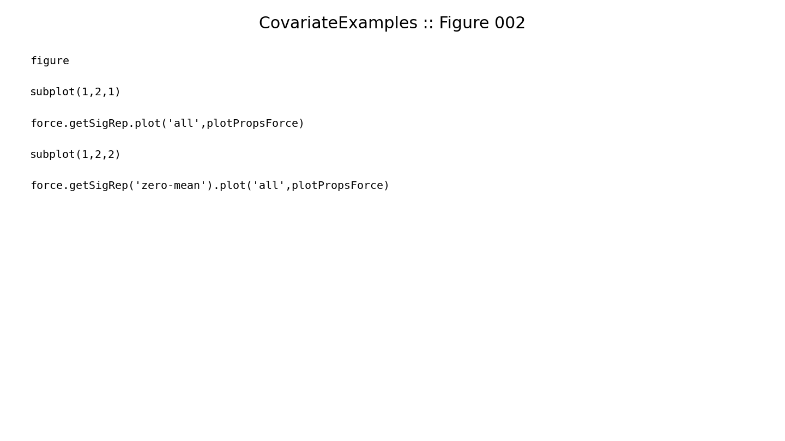

# CovariateExamples — figure gallery

This page is the rendered figure output of
[`notebooks/CovariateExamples.ipynb`](../../notebooks/CovariateExamples.ipynb).
Each PNG is an output of the notebook's ``FigureTracker``; placeholder
MATLAB-line annotations look like blank pages with code snippets and indicate the
notebook is a MATLAB-helpfile port rather than a narrative example.

- Source notebook: [`notebooks/CovariateExamples.ipynb`](../../notebooks/CovariateExamples.ipynb)
- Figures: 2 (1 with substantive plot content)

## Figures

### fig_001.png

### fig_002.png

