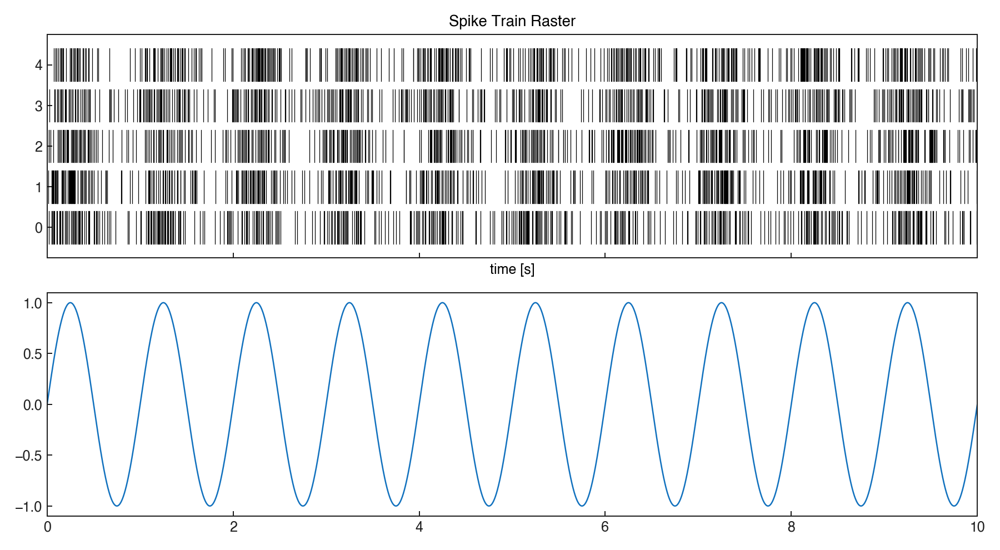
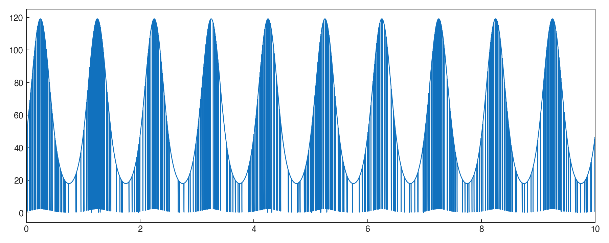
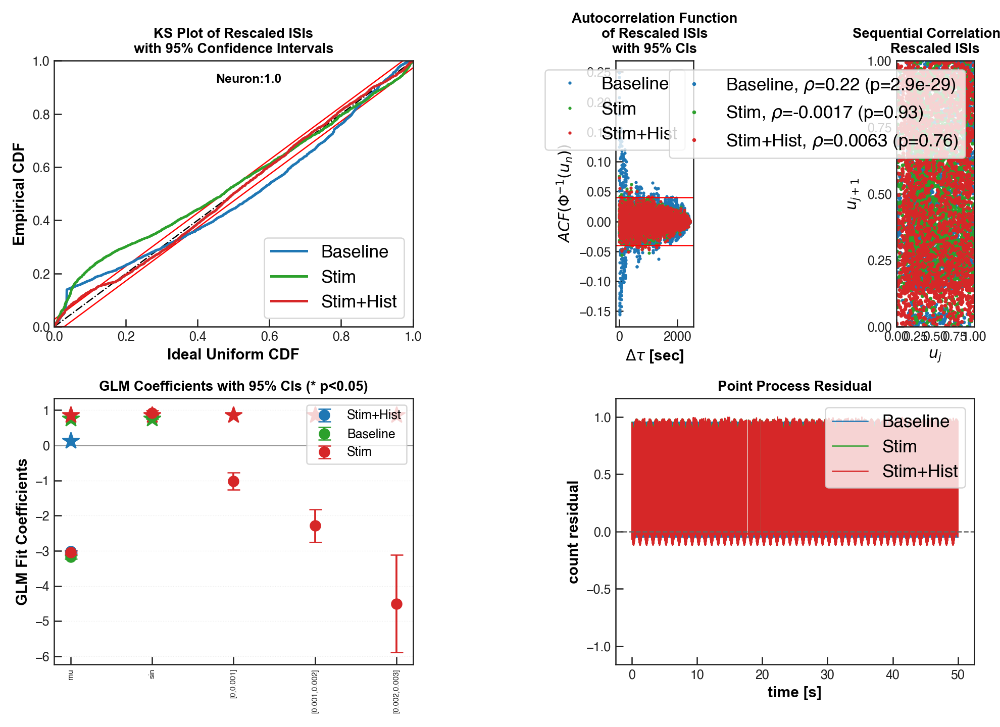

# PPSimExample — figure gallery

This page is the rendered figure output of
[`notebooks/PPSimExample.ipynb`](../../notebooks/PPSimExample.ipynb).
Each PNG is an output of the notebook's ``FigureTracker``; placeholder
MATLAB-line annotations look like blank pages with code snippets and indicate the
notebook is a MATLAB-helpfile port rather than a narrative example.

- Source notebook: [`notebooks/PPSimExample.ipynb`](../../notebooks/PPSimExample.ipynb)
- Figures: 4 (4 with substantive plot content)

## Figures

### fig_001.png

### fig_002.png

### fig_003.png

### fig_004.png

