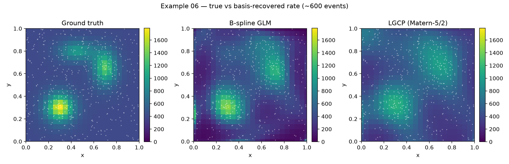
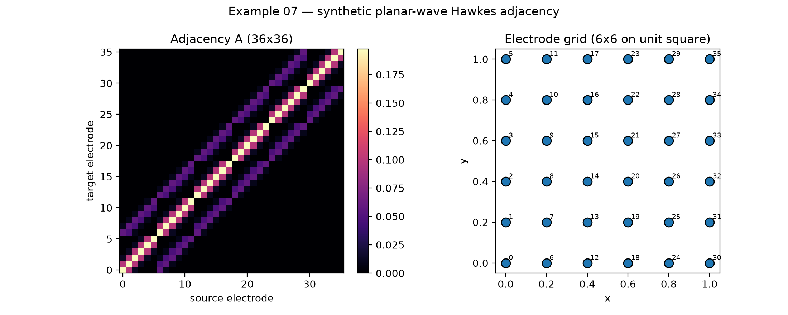
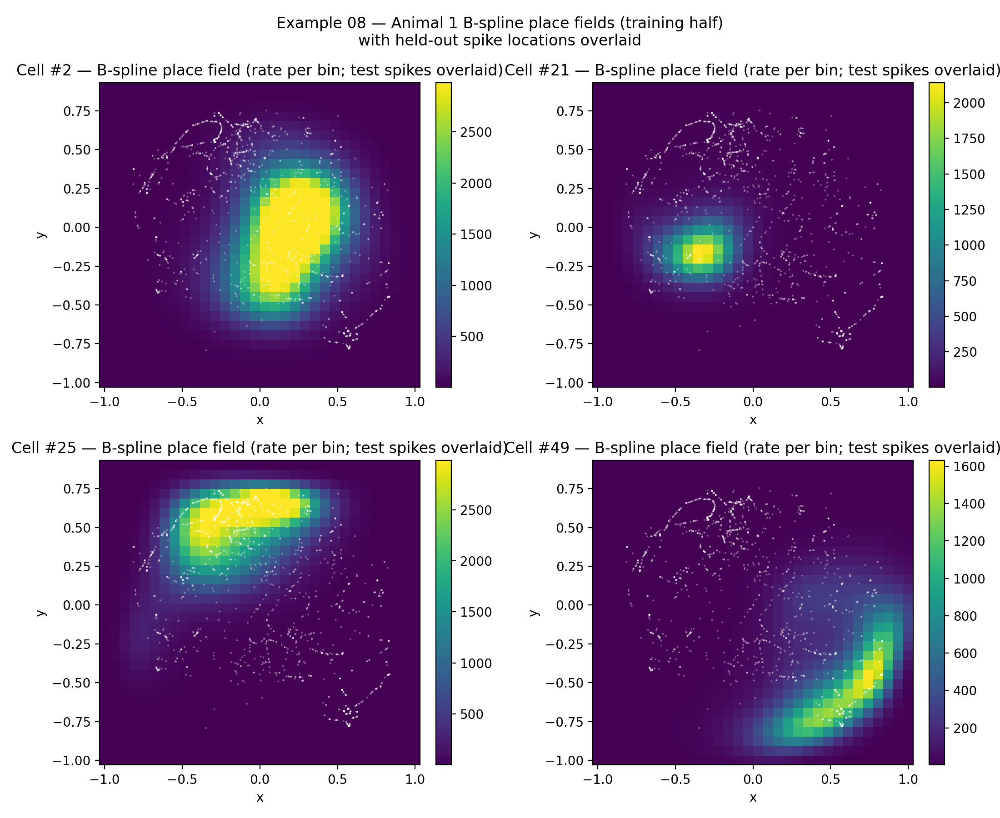

# nSTAT Python Paper Examples

This page mirrors the MATLAB paper-example index for the standalone Python port.

Canonical source files:
- `examples/paper/*.py`
- `nstat/paper_examples_full.py`

## Run Everything

```bash
python tools/paper_examples/build_gallery.py
```

Outputs:
- Figure metadata: `docs/figures/manifest.json`
- Gallery page: `docs/paper_examples.md`
- Figures: `docs/figures/example01/` ... `docs/figures/example05/`

## Example Index

| ID | Thumbnail | Standalone source | Question | Run command | Figure gallery |
|---|---|---|---|---|---|
| `example01` |  | [example01_mepsc_poisson.py](../examples/paper/example01_mepsc_poisson.py) | Do mEPSCs follow constant vs piecewise Poisson firing under Mg2+ washout? | `python examples/paper/example01_mepsc_poisson.py` | [gallery page](./figures/example01/README.md) |
| `example02` |  | [example02_whisker_stimulus_thalamus.py](../examples/paper/example02_whisker_stimulus_thalamus.py) | How do explicit whisker stimulus and spike history improve thalamic GLM fits? | `python examples/paper/example02_whisker_stimulus_thalamus.py` | [gallery page](./figures/example02/README.md) |
| `example03` |  | [example03_psth_and_ssglm.py](../examples/paper/example03_psth_and_ssglm.py) | How do PSTH and SSGLM capture within-trial and across-trial dynamics? | `python examples/paper/example03_psth_and_ssglm.py` | [gallery page](./figures/example03/README.md) |
| `example04` |  | [example04_place_cells_continuous_stimulus.py](../examples/paper/example04_place_cells_continuous_stimulus.py) | Which receptive-field basis (Gaussian vs Zernike) better fits place cells? | `python examples/paper/example04_place_cells_continuous_stimulus.py` | [gallery page](./figures/example04/README.md) |
| `example05` |  | [example05_decoding_ppaf_pphf.py](../examples/paper/example05_decoding_ppaf_pphf.py) | How well do adaptive/hybrid point-process filters decode stimulus and reach state? | `python examples/paper/example05_decoding_ppaf_pphf.py` | [gallery page](./figures/example05/README.md) |
| `example06` |  | [example06_place_fields_glm_basis.py](../examples/paper/example06_place_fields_glm_basis.py) | How does a tensor-product B-spline Poisson GLM recover a known 2-D place field, and how do its rate and second-order diagnostics compare to an LGCP? | `python examples/paper/example06_place_fields_glm_basis.py` | [gallery page](./figures/example06/README.md) |
| `example07` |  | [example07_spatiotemporal_hawkes_waves.py](../examples/paper/example07_spatiotemporal_hawkes_waves.py) | Can the Bartlett spectrum and wave-peak detector recover the speed and direction of a known planar wave embedded in a multivariate Hawkes triggering matrix? | `python examples/paper/example07_spatiotemporal_hawkes_waves.py` | [gallery page](./figures/example07/README.md) |
| `example08` |  | [example08_real_place_cells.py](../examples/paper/example08_real_place_cells.py) | Does a B-spline Poisson GLM trained on real hippocampal place cells produce a held-out spatial pair-correlation inside the inhomogeneous global-rank envelope, and a population rescaled-time ACF inside the Bartlett band? | `python examples/paper/example08_real_place_cells.py` | [gallery page](./figures/example08/README.md) |

```{toctree}
:hidden:

figures/example01/README
figures/example02/README
figures/example03/README
figures/example04/README
figures/example05/README
figures/example06/README
figures/example07/README
figures/example08/README
```

## Gallery

### Example 01: mEPSC Poisson Models Under Constant and Washout Magnesium

Question: Do mEPSCs follow constant vs piecewise Poisson firing under Mg2+ washout?

Run command: `python examples/paper/example01_mepsc_poisson.py`


Expected figure files:
- `docs/figures/example01/fig01_constant_mg_summary.png`
- `docs/figures/example01/fig02_washout_raster_overview.png`
- `docs/figures/example01/fig03_piecewise_baseline_comparison.png`

### Example 02: Whisker Stimulus GLM With Lag and History Selection

Question: How do explicit whisker stimulus and spike history improve thalamic GLM fits?

Run command: `python examples/paper/example02_whisker_stimulus_thalamus.py`


Expected figure files:
- `docs/figures/example02/fig01_data_overview.png`
- `docs/figures/example02/fig02_lag_and_model_comparison.png`

### Example 03: PSTH and SSGLM Dynamics Example

Question: How do PSTH and SSGLM capture within-trial and across-trial dynamics?

Run command: `python examples/paper/example03_psth_and_ssglm.py`


Expected figure files:
- `docs/figures/example03/fig01_simulated_and_real_rasters.png`
- `docs/figures/example03/fig02_psth_comparison.png`
- `docs/figures/example03/fig03_ssglm_simulation_summary.png`
- `docs/figures/example03/fig04_ssglm_fit_diagnostics.png`
- `docs/figures/example03/fig05_stimulus_effect_surfaces.png`
- `docs/figures/example03/fig06_learning_trial_comparison.png`

### Example 04: Place-Cell Receptive Fields (Gaussian vs Zernike)

Question: Which receptive-field basis (Gaussian vs Zernike) better fits place cells?

Run command: `python examples/paper/example04_place_cells_continuous_stimulus.py`


Expected figure files:
- `docs/figures/example04/fig01_example_cells_path_overlay.png`
- `docs/figures/example04/fig02_model_summary_statistics.png`
- `docs/figures/example04/fig03_gaussian_place_fields_animal1.png`
- `docs/figures/example04/fig04_zernike_place_fields_animal1.png`
- `docs/figures/example04/fig05_gaussian_place_fields_animal2.png`
- `docs/figures/example04/fig06_zernike_place_fields_animal2.png`
- `docs/figures/example04/fig07_example_cell_mesh_comparison.png`

### Example 05: Stimulus Decoding With PPAF and PPHF

Question: How well do adaptive/hybrid point-process filters decode stimulus and reach state?

Run command: `python examples/paper/example05_decoding_ppaf_pphf.py`


Expected figure files:
- `docs/figures/example05/fig01_univariate_setup.png`
- `docs/figures/example05/fig02_univariate_decoding.png`
- `docs/figures/example05/fig03_reach_and_population_setup.png`
- `docs/figures/example05/fig04_ppaf_goal_vs_free.png`
- `docs/figures/example05/fig05_hybrid_setup.png`
- `docs/figures/example05/fig06_hybrid_decoding_summary.png`

### Example 06: 2-D Place-Field Recovery With a B-Spline GLM Basis and an LGCP Comparator

Question: How does a tensor-product B-spline Poisson GLM recover a known 2-D place field, and how do its rate and second-order diagnostics compare to an LGCP?

Run command: `python examples/paper/example06_place_fields_glm_basis.py`


Expected figure files:
- `docs/figures/example06/fig01_true_vs_basis_recovered_rate.png`
- `docs/figures/example06/fig02_lgcp_glm_credible_band.png`
- `docs/figures/example06/fig03_pcf_with_global_envelope.png`

### Example 07: Spatiotemporal Wave Analysis of a Synthetic Planar-Wave Hawkes Adjacency

Question: Can the Bartlett spectrum and wave-peak detector recover the speed and direction of a known planar wave embedded in a multivariate Hawkes triggering matrix?

Run command: `python examples/paper/example07_spatiotemporal_hawkes_waves.py`


Expected figure files:
- `docs/figures/example07/fig01_adjacency_and_positions.png`
- `docs/figures/example07/fig02_bartlett_spectrum.png`
- `docs/figures/example07/fig03_detected_peaks_overlay.png`

### Example 08: Real Place-Cell Encoding-and-Decoding With Held-Out Spatial GoF

Question: Does a B-spline Poisson GLM trained on real hippocampal place cells produce a held-out spatial pair-correlation inside the inhomogeneous global-rank envelope, and a population rescaled-time ACF inside the Bartlett band?

Run command: `python examples/paper/example08_real_place_cells.py`


Expected figure files:
- `docs/figures/example08/fig01_real_place_fields_panel.png`
- `docs/figures/example08/fig02_decoded_vs_true_position.png`
- `docs/figures/example08/fig03_pair_correlation_envelope.png`
- `docs/figures/example08/fig04_rescaled_acf.png`
- `docs/figures/example08/fig05_velocity_speed_tuning.png`
- `docs/figures/example08/fig06_decoder_baseline_vs_velocity.png`
- `docs/figures/example08/fig07_history_kernels.png`
- `docs/figures/example08/fig08_decoder_baseline_vs_history.png`
