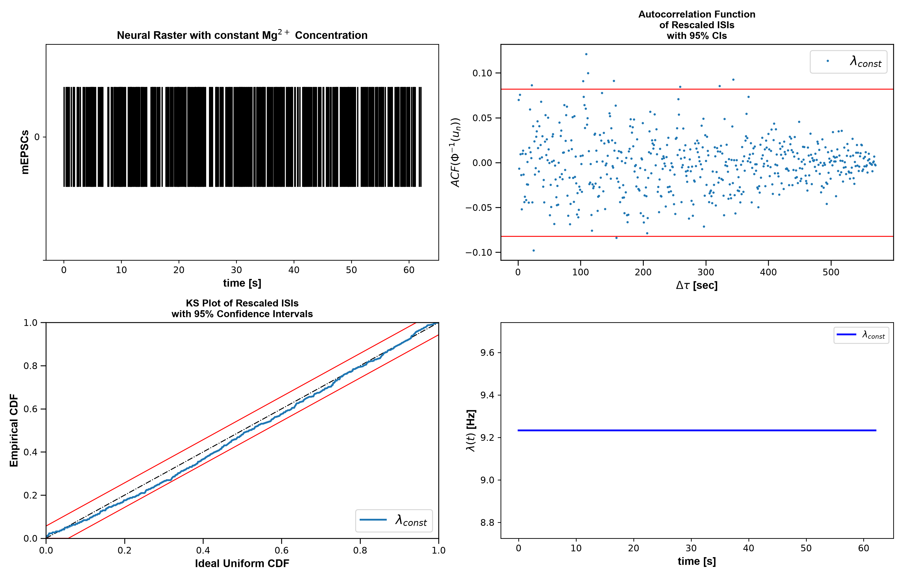
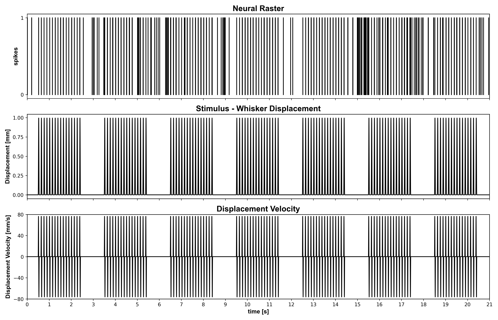
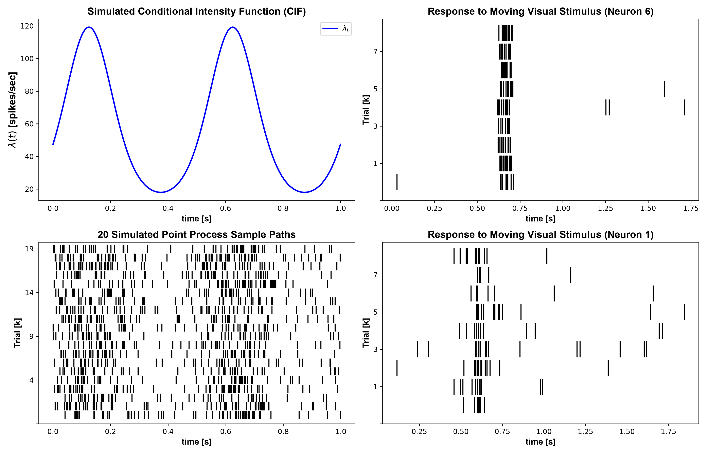
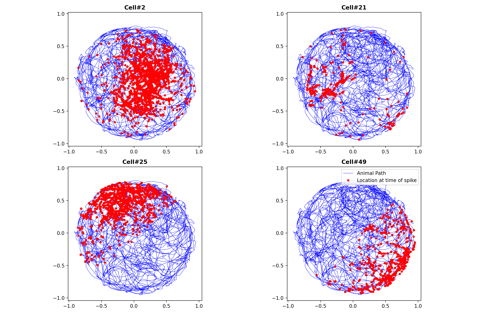
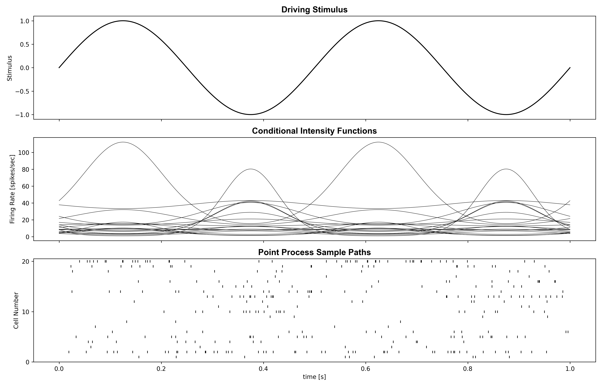

# nSTAT Python Paper Examples

This page mirrors the MATLAB paper-example index for the standalone Python port.

Canonical source files:
- `examples/paper/*.py`
- `nstat/paper_examples_full.py`

## Run Everything

```bash
python tools/paper_examples/build_gallery.py
```

Outputs:
- Figure metadata: `docs/figures/manifest.json`
- Gallery page: `docs/paper_examples.md`
- Figures: `docs/figures/example01/` ... `docs/figures/example05/`

## Example Index

| ID | Thumbnail | Standalone source | Question | Run command | Figure gallery |
|---|---|---|---|---|---|
| `example01` |  | [example01_mepsc_poisson.py](../examples/paper/example01_mepsc_poisson.py) | Does Mg2+ washout produce firing-rate dynamics beyond a constant Poisson baseline? | `python examples/paper/example01_mepsc_poisson.py` | [gallery page](./figures/example01/README.md) |
| `example02` |  | [example02_whisker_stimulus_thalamus.py](../examples/paper/example02_whisker_stimulus_thalamus.py) | What stimulus lag and history order best explain whisker-evoked spike trains? | `python examples/paper/example02_whisker_stimulus_thalamus.py` | [gallery page](./figures/example02/README.md) |
| `example03` |  | [example03_psth_and_ssglm.py](../examples/paper/example03_psth_and_ssglm.py) | How do PSTH and SSGLM differ in capturing trial learning dynamics? | `python examples/paper/example03_psth_and_ssglm.py` | [gallery page](./figures/example03/README.md) |
| `example04` |  | [example04_place_cells_continuous_stimulus.py](../examples/paper/example04_place_cells_continuous_stimulus.py) | How do Gaussian and Zernike basis models compare for place-field mapping? | `python examples/paper/example04_place_cells_continuous_stimulus.py` | [gallery page](./figures/example04/README.md) |
| `example05` |  | [example05_decoding_ppaf_pphf.py](../examples/paper/example05_decoding_ppaf_pphf.py) | How accurately can neural populations decode latent stimulus and reach state? | `python examples/paper/example05_decoding_ppaf_pphf.py` | [gallery page](./figures/example05/README.md) |

```{toctree}
:hidden:

figures/example01/README
figures/example02/README
figures/example03/README
figures/example04/README
figures/example05/README
```

## Gallery

### Example 01: mEPSC Poisson Models Under Constant and Washout Magnesium

Question: Does Mg2+ washout produce firing-rate dynamics beyond a constant Poisson baseline?

Run command: `python examples/paper/example01_mepsc_poisson.py`


Expected figure files:
- `docs/figures/example01/fig01_constant_mg_summary.png`
- `docs/figures/example01/fig02_washout_raster_overview.png`
- `docs/figures/example01/fig03_piecewise_baseline_comparison.png`

### Example 02: Whisker Stimulus GLM With Lag and History Selection

Question: What stimulus lag and history order best explain whisker-evoked spike trains?

Run command: `python examples/paper/example02_whisker_stimulus_thalamus.py`


Expected figure files:
- `docs/figures/example02/fig01_data_overview.png`
- `docs/figures/example02/fig02_lag_and_model_comparison.png`

### Example 03: PSTH and SSGLM Dynamics Example

Question: How do PSTH and SSGLM differ in capturing trial learning dynamics?

Run command: `python examples/paper/example03_psth_and_ssglm.py`


Expected figure files:
- `docs/figures/example03/fig01_simulated_and_real_rasters.png`
- `docs/figures/example03/fig02_psth_comparison.png`
- `docs/figures/example03/fig03_ssglm_simulation_summary.png`
- `docs/figures/example03/fig04_ssglm_fit_diagnostics.png`
- `docs/figures/example03/fig05_stimulus_effect_surfaces.png`
- `docs/figures/example03/fig06_learning_trial_comparison.png`

### Example 04: Place-Cell Receptive Fields (Gaussian vs Zernike)

Question: How do Gaussian and Zernike basis models compare for place-field mapping?

Run command: `python examples/paper/example04_place_cells_continuous_stimulus.py`


Expected figure files:
- `docs/figures/example04/fig01_example_cells_path_overlay.png`
- `docs/figures/example04/fig02_model_summary_statistics.png`
- `docs/figures/example04/fig03_gaussian_place_fields_animal1.png`
- `docs/figures/example04/fig04_zernike_place_fields_animal1.png`
- `docs/figures/example04/fig05_gaussian_place_fields_animal2.png`
- `docs/figures/example04/fig06_zernike_place_fields_animal2.png`
- `docs/figures/example04/fig07_example_cell_mesh_comparison.png`

### Example 05: Stimulus Decoding With PPAF and PPHF

Question: How accurately can neural populations decode latent stimulus and reach state?

Run command: `python examples/paper/example05_decoding_ppaf_pphf.py`


Expected figure files:
- `docs/figures/example05/fig01_univariate_setup.png`
- `docs/figures/example05/fig02_univariate_decoding.png`
- `docs/figures/example05/fig03_reach_and_population_setup.png`
- `docs/figures/example05/fig04_ppaf_goal_vs_free.png`
- `docs/figures/example05/fig05_hybrid_setup.png`
- `docs/figures/example05/fig06_hybrid_decoding_summary.png`
